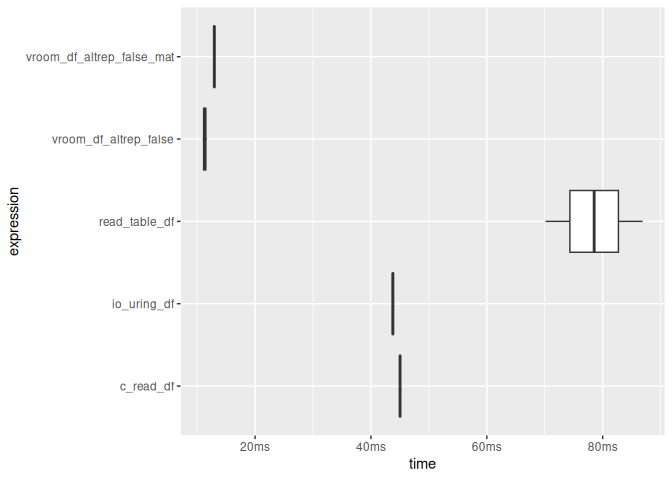
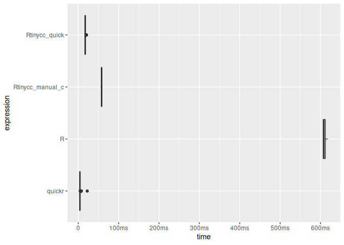
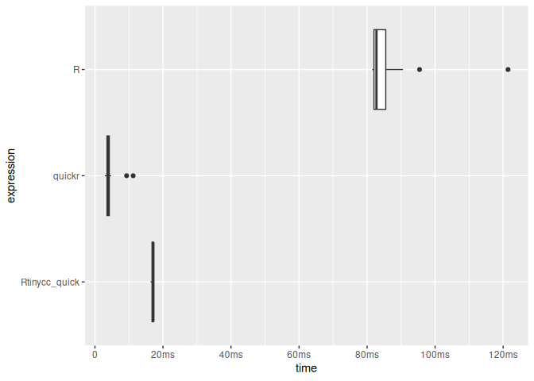

<!-- README.md is generated from README.Rmd. Please edit that file -->

# Rtinycc

Builds `TinyCC` `Cli` and Library For `C` Scripting in `R`

<!-- badges: start -->

[](https://github.com/sounkou-bioinfo/Rtinycc/actions/workflows/R-CMD-check.yaml)[](https://sounkou-bioinfo.r-universe.dev/Rtinycc)
<!-- badges: end -->

## Abstract

Rtinycc is an R interface to [TinyCC](https://github.com/TinyCC/tinycc),
providing both CLI access and a libtcc-backed in-memory compiler. It
includes an experimental FFI inspired by [Bun’s
FFI](https://bun.com/docs/runtime/ffi) for binding C symbols with
predictable type conversions and pointer utilities. The package runs on
unix-alikes and windows( pace UCRT issues, so WSL2 is recommended) and
focuses on embedding TinyCC and enabling JIT-compiled bindings directly
from R. Combined with
[treesitter.c](https://github.com/sounkou-bioinfo/treesitter.c), which
provides C header parsers, it can be used to rapidly generate
declarative bindings.

## How it works

When you call `tcc_compile()`, Rtinycc generates C wrapper functions
whose signature follows the `.Call` convention (`SEXP` in, `SEXP` out).
These wrappers convert R types to C, call the target function, and
convert the result back. TCC compiles them in-memory – no shared library
is written to disk and no `R_init_*` registration is needed.

After `tcc_relocate()`, wrapper pointers are retrieved via
`tcc_get_symbol()`, which internally calls `RC_libtcc_get_symbol()`.
That function converts TCC’s raw `void*` into a `DL_FUNC` wrapped with
`R_MakeExternalPtrFn` (tagged `"native symbol"`). On the R side,
[`make_callable()`](R/ffi.R) creates a closure that passes this external
pointer to `.Call` (aliased as `.RtinyccCall` to keep `R CMD check`
happy).

The design follows [CFFI’s](https://cffi.readthedocs.io/) API-mode
pattern: instead of computing struct layouts and calling conventions in
R (ABI-mode, like Python’s ctypes), the generated C code lets TCC handle
`sizeof`, `offsetof`, and argument passing. Rtinycc never replicates
platform-specific layout rules. The wrappers can also link against
external shared libraries whose symbols TCC resolves at relocation time.
For background on how this compares to a libffi approach, see the
[`RSimpleFFI`
README](https://github.com/sounkou-bioinfo/RSimpleFFI#readme).

On macOS the configure script strips `-flat_namespace` from TCC’s build
to avoid [BUS ERROR
issues](https://genomic.social/@bioinfhotep/115765645745231377). Without
it, TCC cannot resolve host symbols (e.g. `RC_free_finalizer`) through
the dynamic linker. Rtinycc works around this with
`RC_libtcc_add_host_symbols()`, which registers package-internal C
functions via `tcc_add_symbol()` before relocation. Any new C function
referenced by generated TCC code must be added there.

On Windows, the `configure.win` script generates a UCRT-backed
`msvcrt.def` so TinyCC resolves CRT symbols against `ucrtbase.dll` (R
4.2+ uses UCRT).

Ownership semantics are explicit. Pointers from `tcc_malloc()` are
tagged `rtinycc_owned` and can be released with `tcc_free()` (or by
their R finalizer). Generated struct constructors use a struct-specific
tag (`struct_<name>`) with an `RC_free_finalizer`; free them with
`struct_<name>_free()`, not `tcc_free()`. Pointers from `tcc_data_ptr()`
are tagged `rtinycc_borrowed` and are never freed by Rtinycc. Array
returns are copied into a fresh R vector; set `free = TRUE` only when
the C function returns a `malloc`-owned buffer.

## Installation

``` r
install.packages(
      'Rtinycc', 
        repos = c('https://sounkou-bioinfo.r-universe.dev', 
                  'https://cloud.r-project.org')
        )
```

## Usage

### CLI

The CLI interface compiles C source files to standalone executables
using the bundled TinyCC toolchain.

``` r
library(Rtinycc)

src <- system.file("c_examples", "forty_two.c", package = "Rtinycc")
exe <- tempfile()
tcc_run_cli(c(
  "-B", tcc_prefix(),
  paste0("-I", tcc_include_paths()),
  paste0("-L", tcc_lib_paths()),
  src, "-o", exe
))
#> [1] 0
Sys.chmod(exe, mode = "0755")
system2(exe, stdout = TRUE)
#> [1] "42"
```

For in-memory workflows, prefer libtcc instead.

### In-memory compilation with libtcc

We can compile and call C functions entirely in memory. This is the
simplest path for quick JIT compilation.

``` r
state <- tcc_state(output = "memory")
tcc_compile_string(state, "int forty_two(){ return 42; }")
#> [1] 0
tcc_relocate(state)
#> [1] 0
tcc_call_symbol(state, "forty_two", return = "int")
#> [1] 42
```

The lower-level API gives full control over include paths, libraries,
and the R C API. Using `#define _Complex` as a workaround for TCC’s lack
of [complex type
support](https://mail.gnu.org/archive/html/tinycc-devel/2022-04/msg00020.html),
we can link against R’s headers and call into `libR`.

``` r
state <- tcc_state(output = "memory")
tcc_add_include_path(state, R.home("include"))
#> [1] 0
tcc_add_library_path(state, R.home("lib"))
#> [1] 0

code <- '
#define _Complex
#include <R.h>
#include <Rinternals.h>

double call_r_sqrt(void) {
  SEXP fn   = PROTECT(Rf_findFun(Rf_install("sqrt"), R_BaseEnv));
  SEXP val  = PROTECT(Rf_ScalarReal(16.0));
  SEXP call = PROTECT(Rf_lang2(fn, val));
  SEXP out  = PROTECT(Rf_eval(call, R_GlobalEnv));
  double res = REAL(out)[0];
  UNPROTECT(4);
  return res;
}
'
tcc_compile_string(state, code)
#> [1] 0
tcc_relocate(state)
#> [1] 0
tcc_call_symbol(state, "call_r_sqrt", return = "double")
#> [1] 4
```

### Pointer utilities

Rtinycc ships a set of typed memory access functions similar to what the
[ctypesio](https://cran.r-project.org/package=ctypesio) package offers,
but designed around our FFI pointer model. Every scalar C type has a
corresponding `tcc_read_*` / `tcc_write_*` pair that operates at a byte
offset into any external pointer, so you can walk structs, arrays, and
output parameters without writing C helpers.

``` r
ptr <- tcc_cstring("hello")
tcc_read_cstring(ptr)
#> [1] "hello"
tcc_read_bytes(ptr, 5)
#> [1] 68 65 6c 6c 6f
tcc_ptr_addr(ptr, hex = TRUE)
#> [1] "0x5e2a7b3d76b0"
tcc_ptr_is_null(ptr)
#> [1] FALSE
tcc_free(ptr)
#> NULL
```

Typed reads and writes cover the full scalar range (`i8`/`u8`,
`i16`/`u16`, `i32`/`u32`, `i64`/`u64`, `f32`/`f64`) plus pointer
dereferencing via `tcc_read_ptr` / `tcc_write_ptr`. All operations use a
byte offset and `memcpy` internally for alignment safety.

``` r
buf <- tcc_malloc(32)
tcc_write_i32(buf, 0L, 42L)
tcc_write_f64(buf, 8L, pi)
tcc_read_i32(buf, offset = 0L)
#> [1] 42
tcc_read_f64(buf, offset = 8L)
#> [1] 3.141593
tcc_free(buf)
#> NULL
```

Pointer-to-pointer workflows are supported for C APIs that return values
through output parameters.

``` r
ptr_ref <- tcc_malloc(.Machine$sizeof.pointer %||% 8L)
target <- tcc_malloc(8)
tcc_ptr_set(ptr_ref, target)
#> <pointer: 0x5e2a7bbb9c90>
tcc_data_ptr(ptr_ref)
#> <pointer: 0x5e2a7a7a7280>
tcc_ptr_set(ptr_ref, tcc_null_ptr())
#> <pointer: 0x5e2a7bbb9c90>
tcc_free(target)
#> NULL
tcc_free(ptr_ref)
#> NULL
```

## Declarative FFI

A declarative interface inspired by [Bun’s
FFI](https://bun.com/docs/runtime/ffi) sits on top of the lower-level
API. We define types explicitly and Rtinycc generates the binding code,
compiling it in memory with TCC.

### Type system

The FFI exposes a small set of type mappings between R and C.
Conversions are explicit and predictable so callers know when data is
shared versus copied.

Scalar types map one-to-one: `i8`, `i16`, `i32`, `i64` (integers); `u8`,
`u16`, `u32`, `u64` (unsigned); `f32`, `f64` (floats); `bool` (logical);
`cstring` (NUL-terminated string).

Array arguments pass R vectors to C with zero copy: `raw` maps to
`uint8_t*`, `integer_array` to `int32_t*`, `numeric_array` to `double*`.

Pointer types include `ptr` (opaque external pointer), `sexp` (pass a
`SEXP` directly), and callback signatures like
`callback:double(double)`.

Array returns use
`returns = list(type = "integer_array", length_arg = 2, free = TRUE)` to
copy the result into a new R vector. The `length_arg` is the 1-based
index of the C argument that carries the array length. Set `free = TRUE`
when the C function returns a `malloc`-owned buffer.

### Simple functions

``` r
ffi <- tcc_ffi() |>
  tcc_source("
    int add(int a, int b) { return a + b; }
  ") |>
  tcc_bind(add = list(args = list("i32", "i32"), returns = "i32")) |>
  tcc_compile()

ffi$add(5L, 3L)
#> [1] 8

# Compare to the R builtin `+` in a tight loop.
# Each FFI call allocates a return SEXP, so GC pressure is expected.
r_p <- sample(10000)
bench::mark(
  Rtinycc = { for ( i in seq_along(r_p)) ffi$add(i, 1) },
  Rbuiltin = { for ( i in seq_along(r_p)) i + 1 }

)
#> Warning: Some expressions had a GC in every iteration; so filtering is
#> disabled.
#> # A tibble: 2 × 6
#>   expression      min   median `itr/sec` mem_alloc `gc/sec`
#>   <bch:expr> <bch:tm> <bch:tm>     <dbl> <bch:byt>    <dbl>
#> 1 Rtinycc       920ms    920ms      1.09   134.1MB    10.9 
#> 2 Rbuiltin      562µs    592µs   1154.      9.05KB     5.91

# For performance-sensitive code, move the loop into C and operate on arrays.
ffi_vec <- tcc_ffi() |>
  tcc_source(" \
    void add_vec(int32_t* x, int32_t n) {\
      for (int32_t i = 0; i < n; i++) x[i] = x[i] + 1;\
    }\
  ") |>
  tcc_bind(add_vec = list(args = list("integer_array", "i32"), returns = "void")) |>
  tcc_compile()

x <- sample(10000)
bench::mark(
  Rtinycc_vec = {
    y <- as.integer(x)
    y <- y + 0L
    ffi_vec$add_vec(y, length(y))
    y
  },
  Rbuiltin_vec = {
    y <- as.integer(x)
    y <- y + 0L
    y + 1L
  }
)
#> # A tibble: 2 × 6
#>   expression        min   median `itr/sec` mem_alloc `gc/sec`
#>   <bch:expr>   <bch:tm> <bch:tm>     <dbl> <bch:byt>    <dbl>
#> 1 Rtinycc_vec    97.5µs  106.5µs     9244.    52.8KB     6.16
#> 2 Rbuiltin_vec   16.5µs   17.6µs    53449.    78.2KB    42.8
```

### Variadic calls (e.g. `Rprintf` style)

Rtinycc supports two ways to bind variadic tails. The legacy approach
uses `varargs` as a typed prefix tail, while the bounded dynamic
approach uses `varargs_types` together with `varargs_min` and
`varargs_max`. In the bounded mode, wrappers are generated across the
allowed arity and type combinations, and runtime dispatch selects the
matching wrapper from the scalar tail values provided at call time.

``` r
ffi_var <- tcc_ffi() |>
  tcc_header("#include <R_ext/Print.h>") |>
  tcc_source('
    #include <stdarg.h>

    int sum_fmt(int n, ...) {
      va_list ap;
      va_start(ap, n);
      int s = 0;
      for (int i = 0; i < n; i++) s += va_arg(ap, int);
      va_end(ap);
      Rprintf("sum_fmt(%d) = %d\\n", n, s);
      return s;
    }
  ') |>
  tcc_bind(
    Rprintf = list(
      args = list("cstring"),
      variadic = TRUE,
      varargs_types = list("i32"),
      varargs_min = 0L,
      varargs_max = 4L,
      returns = "void"
    ),
    sum_fmt = list(
      args = list("i32"),
      variadic = TRUE,
      varargs_types = list("i32"),
      varargs_min = 0L,
      varargs_max = 4L,
      returns = "i32"
    )
  ) |>
  tcc_compile()

ffi_var$Rprintf("Rprintf via bind: %d + %d = %d\n", 2L, 3L, 5L)
#> Rprintf via bind: 2 + 3 = 5
#> NULL
ffi_var$sum_fmt(0L)
#> sum_fmt(0) = 0
#> [1] 0
ffi_var$sum_fmt(2L, 10L, 20L)
#> sum_fmt(2) = 30
#> [1] 30
ffi_var$sum_fmt(4L, 1L, 2L, 3L, 4L)
#> sum_fmt(4) = 10
#> [1] 10
```

### Linking external libraries

We can bind directly to symbols in shared libraries. Here we link
against `libm`.

``` r
math <- tcc_ffi() |>
  tcc_library("m") |>
  tcc_bind(
    sqrt  = list(args = list("f64"), returns = "f64"),
    sin   = list(args = list("f64"), returns = "f64"),
    floor = list(args = list("f64"), returns = "f64")
  ) |>
  tcc_compile()

math$sqrt(16.0)
#> [1] 4
math$sin(pi / 2)
#> [1] 1
math$floor(3.7)
#> [1] 3
```

### Working with arrays

R vectors are passed to C with zero copy. Mutations in C are visible in
R.

``` r
ffi <- tcc_ffi() |>
  tcc_source("
    #include <stdlib.h>
    #include <string.h>

    int64_t sum_array(int32_t* arr, int32_t n) {
      int64_t s = 0;
      for (int i = 0; i < n; i++) s += arr[i];
      return s;
    }

    void bump_first(int32_t* arr) { arr[0] += 10; }

    int32_t* dup_array(int32_t* arr, int32_t n) {
      int32_t* out = malloc(sizeof(int32_t) * n);
      memcpy(out, arr, sizeof(int32_t) * n);
      return out;
    }
  ") |>
  tcc_bind(
    sum_array  = list(args = list("integer_array", "i32"), returns = "i64"),
    bump_first = list(args = list("integer_array"), returns = "void"),
    dup_array  = list(
      args = list("integer_array", "i32"),
      returns = list(type = "integer_array", length_arg = 2, free = TRUE)
    )
  ) |>
  tcc_compile()

x <- as.integer(1:100) # to avoid ALTREP
.Internal(inspect(x))
#> @5e2a8ffff7e8 13 INTSXP g0c0 [REF(65535)]  1 : 100 (compact)
ffi$sum_array(x, length(x))
#> [1] 5050

# Zero-copy: C mutation reflects in R
ffi$bump_first(x)
#> NULL
x[1]
#> [1] 11

# Array return: copied into a new R vector, C buffer freed
y <- ffi$dup_array(x, length(x))
y[1]
#> [1] 11

.Internal(inspect(x))
#> @5e2a8ffff7e8 13 INTSXP g0c0 [REF(65535)]  11 : 110 (expanded)
```

## Advanced FFI features

### Structs and unions

Complex C types are supported declaratively. Use `tcc_struct()` to
generate allocation and accessor helpers. Free instances when done.

``` r
ffi <- tcc_ffi() |>
  tcc_source('
    #include <math.h>
    struct point { double x; double y; };
    double distance(struct point* a, struct point* b) {
      double dx = a->x - b->x, dy = a->y - b->y;
      return sqrt(dx * dx + dy * dy);
    }
  ') |>
  tcc_library("m") |>
  tcc_struct("point", accessors = c(x = "f64", y = "f64")) |>
  tcc_bind(distance = list(args = list("ptr", "ptr"), returns = "f64")) |>
  tcc_compile()

p1 <- ffi$struct_point_new()
ffi$struct_point_set_x(p1, 0.0)
#> <pointer: 0x5e2a88717050>
ffi$struct_point_set_y(p1, 0.0)
#> <pointer: 0x5e2a88717050>

p2 <- ffi$struct_point_new()
ffi$struct_point_set_x(p2, 3.0)
#> <pointer: 0x5e2a9464cf20>
ffi$struct_point_set_y(p2, 4.0)
#> <pointer: 0x5e2a9464cf20>

ffi$distance(p1, p2)
#> [1] 5

ffi$struct_point_free(p1)
#> NULL
ffi$struct_point_free(p2)
#> NULL
```

### Enums

Enums are exposed as helper functions that return integer constants.

``` r
ffi <- tcc_ffi() |>
  tcc_source("enum color { RED = 0, GREEN = 1, BLUE = 2 };") |>
  tcc_enum("color", constants = c("RED", "GREEN", "BLUE")) |>
  tcc_compile()

ffi$enum_color_RED()
#> [1] 0
ffi$enum_color_BLUE()
#> [1] 2
```

### Bitfields

Bitfields are handled by TCC. Accessors read and write them like normal
fields.

``` r
ffi <- tcc_ffi() |>
  tcc_source("
    struct flags {
      unsigned int active : 1;
      unsigned int level  : 4;
    };
  ") |>
  tcc_struct("flags", accessors = c(active = "u8", level = "u8")) |>
  tcc_compile()

s <- ffi$struct_flags_new()
ffi$struct_flags_set_active(s, 1L)
#> <pointer: 0x5e2a828ea190>
ffi$struct_flags_set_level(s, 9L)
#> <pointer: 0x5e2a828ea190>
ffi$struct_flags_get_active(s)
#> [1] 1
ffi$struct_flags_get_level(s)
#> [1] 9
ffi$struct_flags_free(s)
#> NULL
```

### Global getters and setters

C globals can be exposed with explicit getter/setter helpers.

``` r
ffi <- tcc_ffi() |>
  tcc_source("
    int counter = 7;
    double pi_approx = 3.14159;
  ") |>
  tcc_global("counter", "i32") |>
  tcc_global("pi_approx", "f64") |>
  tcc_compile()

ffi$global_counter_get()
#> [1] 7
ffi$global_pi_approx_get()
#> [1] 3.14159
ffi$global_counter_set(42L)
#> [1] 42
ffi$global_counter_get()
#> [1] 42
```

### Callbacks

R functions can be registered as C function pointers via
`tcc_callback()` and passed to compiled code. Specify a
`callback:<signature>` argument in `tcc_bind()` so the trampoline is
generated automatically. Always close callbacks when done.

``` r
cb <- tcc_callback(function(x) x * x, signature = "double (*)(double)")

code <- '
double apply_fn(double (*fn)(void* ctx, double), void* ctx, double x) {
  return fn(ctx, x);
}
'

ffi <- tcc_ffi() |>
  tcc_source(code) |>
  tcc_bind(
    apply_fn = list(
      args = list("callback:double(double)", "ptr", "f64"),
      returns = "f64"
    )
  ) |>
  tcc_compile()

ffi$apply_fn(cb, tcc_callback_ptr(cb), 7.0)
#> [1] 49
tcc_callback_close(cb)
```

### Callback errors

If a callback throws an R error, the trampoline catches it, emits a
warning, and returns a type-appropriate default (0 for numeric, `FALSE`
for logical, `NULL` for pointer). This prevents C code from seeing an
unwound stack.

``` r
cb_err <- tcc_callback(
  function(x) stop("boom"),
  signature = "double (*)(double)"
)

ffi_err <- tcc_ffi() |>
  tcc_source('
    double call_cb_err(double (*cb)(void* ctx, double), void* ctx, double x) {
      return cb(ctx, x);
    }
  ') |>
  tcc_bind(
    call_cb_err = list(
      args = list("callback:double(double)", "ptr", "f64"),
      returns = "f64"
    )
  ) |>
  tcc_compile()

warned <- FALSE
res <- withCallingHandlers(
  ffi_err$call_cb_err(cb_err, tcc_callback_ptr(cb_err), 1.0),
  warning = function(w) {
    warned <<- TRUE
    invokeRestart("muffleWarning")
  }
)
list(warned = warned, result = res)
#> $warned
#> [1] TRUE
#> 
#> $result
#> [1] NA
tcc_callback_close(cb_err)
```

### Async callbacks

For thread-safe scheduling from worker threads, use
`callback_async:<signature>` in `tcc_bind()`. The callback is enqueued
from any thread and executed on the main R thread when you call
`tcc_callback_async_drain()`. Call `tcc_callback_async_enable()` once
before use.

``` r
tcc_callback_async_enable()

hits <- 0L
cb_async <- tcc_callback(
  function(x) { hits <<- hits + x; NULL },
  signature = "void (*)(int)"
)

code_async <- '
#include <pthread.h>

struct task { void (*cb)(void* ctx, int); void* ctx; int value; };

static void* worker(void* data) {
  struct task* t = (struct task*) data;
  t->cb(t->ctx, t->value);
  return NULL;
}

int spawn_async(void (*cb)(void* ctx, int), void* ctx, int value) {
  if (!cb || !ctx) return -1;
  const int n = 100;
  struct task tasks[100];
  pthread_t th[100];
  for (int i = 0; i < n; i++) {
    tasks[i].cb = cb;
    tasks[i].ctx = ctx;
    tasks[i].value = value;
    if (pthread_create(&th[i], NULL, worker, &tasks[i]) != 0) {
      for (int j = 0; j < i; j++) pthread_join(th[j], NULL);
      return -2;
    }
  }
  for (int i = 0; i < n; i++) pthread_join(th[i], NULL);
  return 0;
}
'

ffi_async <- tcc_ffi() |>
  tcc_source(code_async) |>
  tcc_library("pthread") |>
  tcc_bind(
    spawn_async = list(
      args = list("callback_async:void(int)", "ptr", "i32"),
      returns = "i32"
    )
  ) |>
  tcc_compile()

rc <- ffi_async$spawn_async(cb_async, tcc_callback_ptr(cb_async), 2L)
tcc_callback_async_drain()
hits
#> [1] 200
tcc_callback_close(cb_async)
```

### SQLite: a complete example

This example ties together external library linking, callbacks, and
pointer dereferencing. We open an in-memory SQLite database, execute
queries, and collect rows through an R callback that reads `char**`
arrays using `tcc_read_ptr` and `tcc_read_cstring`.

``` r
ptr_size <- .Machine$sizeof.pointer

read_string_array <- function(ptr, n) {
  vapply(seq_len(n), function(i) {
    tcc_read_cstring(tcc_read_ptr(ptr, (i - 1L) * ptr_size))
  }, "")
}

cb <- tcc_callback(
  function(argc, argv, cols) {
    values <- read_string_array(argv, argc)
    names  <- read_string_array(cols, argc)
    cat(paste(names, values, sep = " = ", collapse = ", "), "\n")
    0L
  },
  signature = "int (*)(int, char **, char **)"
)

sqlite <- tcc_ffi() |>
  tcc_header("#include <sqlite3.h>") |>
  tcc_library("sqlite3") |>
  tcc_source('
    void* open_db() {
      sqlite3* db = NULL;
      sqlite3_open(":memory:", &db);
      return db;
    }
    int close_db(void* db) {
      return sqlite3_close((sqlite3*)db);
    }
  ') |>
  tcc_bind(
    open_db  = list(args = list(), returns = "ptr"),
    close_db = list(args = list("ptr"), returns = "i32"),
    sqlite3_libversion = list(args = list(), returns = "cstring"),
    sqlite3_exec = list(
      args = list("ptr", "cstring", "callback:int(int, char **, char **)", "ptr", "ptr"),
      returns = "i32"
    )
  ) |>
  tcc_compile()

sqlite$sqlite3_libversion()
#> [1] "3.45.1"

db <- sqlite$open_db()
sqlite$sqlite3_exec(db, "CREATE TABLE t (id INTEGER, name TEXT);", cb, tcc_callback_ptr(cb), tcc_null_ptr())
#> [1] 0
sqlite$sqlite3_exec(db, "INSERT INTO t VALUES (1, 'hello'), (2, 'world');", cb, tcc_callback_ptr(cb), tcc_null_ptr())
#> [1] 0
sqlite$sqlite3_exec(db, "SELECT * FROM t;", cb, tcc_callback_ptr(cb), tcc_null_ptr())
#> id = 1, name = hello 
#> id = 2, name = world
#> [1] 0
sqlite$close_db(db)
#> [1] 0
tcc_callback_close(cb)
```

## Header parsing with treesitter.c

For header-driven bindings, we use `treesitter.c` to parse function
signatures and generate binding specifications automatically. For
struct, enum, and global helpers, `tcc_generate_bindings()` handles the
code generation.

The default mapper is conservative for pointers: `char*` is treated as
`ptr` because C does not guarantee NUL-terminated strings. If you know a
parameter is a C string, provide a custom mapper that returns `cstring`
for that type.

``` r
header <- '
double sqrt(double x);
double sin(double x);
struct point { double x; double y; };
enum status { OK = 0, ERROR = 1 };
int global_counter;
'

tcc_treesitter_functions(header)
#>   capture_name text start_line start_col params return_type
#> 1    decl_name sqrt          2         8 double      double
#> 2    decl_name  sin          3         8 double      double
tcc_treesitter_structs(header)
#>   capture_name  text start_line
#> 1  struct_name point          4
tcc_treesitter_enums(header)
#>   capture_name   text start_line
#> 1    enum_name status          5
tcc_treesitter_globals(header)
#>   capture_name           text start_line
#> 1  global_name global_counter          6

# Bind parsed functions to libm
symbols <- tcc_treesitter_bindings(header)
math <- tcc_link("m", symbols = symbols)
math$sqrt(16.0)
#> [1] 4

# Generate struct/enum/global helpers
ffi <- tcc_ffi() |>
  tcc_source(header) |>
  tcc_generate_bindings(
    header,
    functions = FALSE, structs = TRUE,
    enums = TRUE, globals = TRUE
  ) |>
  tcc_compile()

ffi$struct_point_new()
#> <pointer: 0x5e2a88769e50>
ffi$enum_status_OK()
#> [1] 0
ffi$global_global_counter_get()
#> [1] 0
```

## io_uring Demo

`CSV` parser using [`io_uring`](https://en.wikipedia.org/wiki/Io_uring)
on linux

``` r
if (Sys.info()[["sysname"]] == "Linux") {
  c_file <- system.file("c_examples", "io_uring_csv.c", package = "Rtinycc")

  n_rows <- 20000L
  n_cols <- 8L
  block_size <- 1024L * 1024L

  set.seed(42)
  tmp_csv <- tempfile("rtinycc_io_uring_readme_", fileext = ".csv")
  on.exit(unlink(tmp_csv), add = TRUE)

  mat <- matrix(runif(n_rows * n_cols), ncol = n_cols)
  df <- as.data.frame(mat)
  names(df) <- paste0("V", seq_len(n_cols))
  utils::write.table(df, file = tmp_csv, sep = ",", row.names = FALSE, col.names = TRUE, quote = FALSE)
  csv_size_mb <- as.double(file.info(tmp_csv)$size) / 1024^2
  message(sprintf("CSV size: %.2f MB", csv_size_mb))

  io_uring_src <- paste(readLines(c_file, warn = FALSE), collapse = "\n")

  ffi <- tcc_ffi() |>
    tcc_source(io_uring_src) |>
    tcc_bind(
      csv_table_read = list(
        args = list("cstring", "i32", "i32"),
        returns = "sexp"
      ),
      csv_table_io_uring = list(
        args = list("cstring", "i32", "i32"),
        returns = "sexp"
      )
    ) |>
    tcc_compile()

  baseline <- utils::read.table(tmp_csv, sep = ",", header = TRUE)
  c_tbl <- ffi$csv_table_read(tmp_csv, block_size, n_cols)
  uring_tbl <- ffi$csv_table_io_uring(tmp_csv, block_size, n_cols)
  vroom_tbl <- vroom::vroom(
    tmp_csv,
    delim = ",",
    altrep = FALSE,
    col_types = vroom::cols(.default = "d"),
    progress = FALSE,
    show_col_types = FALSE
  )

  stopifnot(
    identical(dim(c_tbl), dim(baseline)),
    identical(dim(uring_tbl), dim(baseline)),
    identical(dim(vroom_tbl), dim(baseline)),
    isTRUE(all.equal(c_tbl, baseline, tolerance = 1e-8, check.attributes = FALSE)),
    isTRUE(all.equal(uring_tbl, baseline, tolerance = 1e-8, check.attributes = FALSE)),
    isTRUE(all.equal(vroom_tbl, baseline, tolerance = 1e-8, check.attributes = FALSE))
  )

  timings <- bench::mark(
    read_table_df = {
      x <- utils::read.table(tmp_csv, sep = ",", header = TRUE)
      nrow(x)
    },
    vroom_df_altrep_false = {
      x <- vroom::vroom(
        tmp_csv,
        delim = ",",
        altrep = FALSE,
        col_types = vroom::cols(.default = "d"),
        progress = FALSE,
        show_col_types = FALSE
      )
      nrow(x)
    },
     vroom_df_altrep_false_mat = {
      vroom::vroom(
        tmp_csv,
        delim = ",",
        altrep = FALSE,
        col_types = vroom::cols(.default = "d"),
        progress = FALSE,
        show_col_types = FALSE
      )
      nrow(x)
    },
    c_read_df = {
      x <- ffi$csv_table_read(tmp_csv, block_size, n_cols)
      nrow(x)
    },
    io_uring_df = {
      x <- ffi$csv_table_io_uring(tmp_csv, block_size, n_cols)
      nrow(x)
    },
    iterations = 2,
    memory = TRUE
  )

  
  print(timings)
  
  plot(timings, type = "boxplot") + bench::scale_x_bench_time(base = NULL)
}
#> CSV size: 2.75 MB
#> # A tibble: 5 × 13
#>   expression     min  median `itr/sec` mem_alloc `gc/sec` n_itr  n_gc total_time
#>   <bch:expr> <bch:t> <bch:t>     <dbl> <bch:byt>    <dbl> <int> <dbl>   <bch:tm>
#> 1 read_tabl…  46.4ms 48.46ms      20.6    6.33MB        0     2     0     96.9ms
#> 2 vroom_df_…  7.31ms  7.53ms     133.     1.22MB        0     2     0     15.1ms
#> 3 vroom_df_…  7.67ms  7.88ms     127.     1.22MB        0     2     0     15.8ms
#> 4 c_read_df  20.99ms 21.16ms      47.3    1.23MB        0     2     0     42.3ms
#> 5 io_uring_… 21.27ms 21.44ms      46.6    1.23MB        0     2     0     42.9ms
#> # ℹ 4 more variables: result <list>, memory <list>, time <list>, gc <list>
```



## tcc_quick

`tcc_quick()` is the experimental R-to-C transpiler path in Rtinycc. It
compiles a declared subset of R code into C and executes it via TinyCC,
while preserving a safe fallback route to R evaluation through
`Rf_lang*` + `Rf_eval` when needed.

### Convolution benchmark

This example benchmarks the classic convolution routine written in plain
C (no manual `SEXP` code). Rtinycc generates the `.Call` wrappers
automatically. We compare base R, `quickr`, `tcc_quick`, and a
hand-written C FFI baseline.

``` r
library(quickr)

slow_convolve <- function(a, b) {
  declare(type(a = double(NA)), type(b = double(NA)))
  ab <- double(length(a) + length(b) - 1)
  for (i in seq_along(a)) {
    for (j in seq_along(b)) {
      ab[i + j - 1] <- ab[i + j - 1] + a[i] * b[j]
    }
  }
  ab
}

ffi_conv <- tcc_ffi() |>
  tcc_source(" \
    #include <stdlib.h>\
    double* convolve(const double* a, int na, const double* b, int nb, int nab) {\
      double* ab = (double*)calloc((size_t)nab, sizeof(double));\
      if (!ab) return NULL;\
      for (int i = 0; i < na; i++) {\
        for (int j = 0; j < nb; j++) {\
          ab[i + j] += a[i] * b[j];\
        }\
      }\
      return ab;\
    }\
  ") |>
  tcc_bind(
    convolve = list(
      args = list("numeric_array", "i32", "numeric_array", "i32", "i32"),
      returns = list(type = "numeric_array", length_arg = 5, free = TRUE)
    )
  ) |>
  tcc_compile()

set.seed(1)
a <- runif(100000)
b <- runif(100)
na <- length(a)
nb <- length(b)
nab <- na + nb - 1L

quick_convolve <- quick(slow_convolve)
quick_tcc <- tcc_quick(slow_convolve, fallback = "never")

stopifnot(
  isTRUE(all.equal(slow_convolve(a, b), quick_tcc(a, b), tolerance = 1e-10))
)

timings <- bench::mark(
  R = slow_convolve(a, b),
  quickr = quick_convolve(a, b),
  Rtinycc_quick = quick_tcc(a, b),
  Rtinycc_manual_c = ffi_conv$convolve(a, na, b, nb, nab),
  min_time = 2
)
print(timings)
#> # A tibble: 4 × 13
#>   expression            min   median `itr/sec` mem_alloc `gc/sec` n_itr  n_gc
#>   <bch:expr>       <bch:tm> <bch:tm>     <dbl> <bch:byt>    <dbl> <int> <dbl>
#> 1 R                600.07ms 614.96ms      1.63     782KB     0        4     0
#> 2 quickr             3.63ms   4.13ms    241.       782KB     2.57   470     5
#> 3 Rtinycc_quick     17.14ms  17.35ms     57.5      796KB     1.05   110     2
#> 4 Rtinycc_manual_c  56.73ms  57.56ms     17.4      796KB     0       35     0
#> # ℹ 5 more variables: total_time <bch:tm>, result <list>, memory <list>,
#> #   time <list>, gc <list>
plot(timings, type = "boxplot") + bench::scale_x_bench_time(base = NULL)
```



### Rolling mean benchmark (exact quickr README example)

This example is copied from the quickr README, then compiled with both
`quickr::quick()` and `tcc_quick()` to track progress on the same
constructs.

``` r
slow_roll_mean <- function(x, weights, normalize = TRUE) {
  declare(
    type(x = double(NA)),
    type(weights = double(NA)),
    type(normalize = logical(1))
  )
  out <- double(length(x) - length(weights) + 1)
  n <- length(weights)
  if (normalize)
    weights <- weights/sum(weights)*length(weights)

  for(i in seq_along(out)) {
    out[i] <- sum(x[i:(i+n-1)] * weights) / length(weights)
  }
  out
}

quickr_roll_mean <- quick(slow_roll_mean)
quick_tcc_roll_mean <- tcc_quick(slow_roll_mean, fallback = "never")

x <- dnorm(seq(-3, 3, len = 100000))
weights <- dnorm(seq(-1, 1, len = 100))

timings_roll_mean <- bench::mark(
  r = slow_roll_mean(x, weights),
  quickr = quickr_roll_mean(x, weights = weights),
  Rtinycc_quick = quick_tcc_roll_mean(x, weights = weights),
  min_time = 1
)
#> Warning: Some expressions had a GC in every iteration; so filtering is
#> disabled.
timings_roll_mean
#> # A tibble: 3 × 6
#>   expression         min   median `itr/sec` mem_alloc `gc/sec`
#>   <bch:expr>    <bch:tm> <bch:tm>     <dbl> <bch:byt>    <dbl>
#> 1 r              73.93ms  79.63ms      10.5     124MB   11.5  
#> 2 quickr          2.99ms   4.04ms     251.      781KB    0.997
#> 3 Rtinycc_quick  16.52ms  16.62ms      60.0     795KB    0

timings_roll_mean$expression <- factor(names(timings_roll_mean$expression), rev(names(timings_roll_mean$expression)))
plot(timings_roll_mean, type = "boxplot") + bench::scale_x_bench_time(base = NULL)
```



## Known limitations

### `_Complex` types

TCC does not support C99 `_Complex` types. Generated code works around
this with `#define _Complex`, which suppresses the keyword. Apply the
same workaround in your own `tcc_source()` code when headers pull in
complex types.

### 64-bit integer precision

R represents `i64` and `u64` values as `double`, which loses precision
beyond $2^{53}$. Values that differ only past that threshold become
indistinguishable.

``` r
sprintf("2^53:     %.0f", 2^53)
#> [1] "2^53:     9007199254740992"
sprintf("2^53 + 1: %.0f", 2^53 + 1)
#> [1] "2^53 + 1: 9007199254740992"
identical(2^53, 2^53 + 1)
#> [1] TRUE
```

For exact 64-bit arithmetic, keep values in C-allocated storage and
manipulate them through pointers.

### Nested structs

The accessor generator does not handle nested structs by value. Use
pointer fields instead and reach inner structs with `tcc_field_addr()`.

``` r
ffi <- tcc_ffi() |>
  tcc_source('
    struct inner { int a; };
    struct outer { struct inner* in; };
  ') |>
  tcc_struct("inner", accessors = c(a = "i32")) |>
  tcc_struct("outer", accessors = c(`in` = "ptr")) |>
  tcc_field_addr("outer", "in") |>
  tcc_compile()

o <- ffi$struct_outer_new()
i <- ffi$struct_inner_new()
ffi$struct_inner_set_a(i, 42L)
#> <pointer: 0x5e2a8875f5b0>

# Write the inner pointer into the outer struct
ffi$struct_outer_in_addr(o) |> tcc_ptr_set(i)
#> <pointer: 0x5e2a80695420>

# Read it back through indirection
ffi$struct_outer_in_addr(o) |>
  tcc_data_ptr() |>
  ffi$struct_inner_get_a()
#> [1] 42

ffi$struct_inner_free(i)
#> NULL
ffi$struct_outer_free(o)
#> NULL
```

### Array fields in structs

Array fields require the `list(type = ..., size = N, array = TRUE)`
syntax in `tcc_struct()`, which generates element-wise accessors.

``` r
ffi <- tcc_ffi() |>
  tcc_source('struct buf { unsigned char data[16]; };') |>
  tcc_struct("buf", accessors = list(
    data = list(type = "u8", size = 16, array = TRUE)
  )) |>
  tcc_compile()

b <- ffi$struct_buf_new()
ffi$struct_buf_set_data_elt(b, 0L, 0xCAL)
#> <pointer: 0x5e2a93b1e7b0>
ffi$struct_buf_set_data_elt(b, 1L, 0xFEL)
#> <pointer: 0x5e2a93b1e7b0>
ffi$struct_buf_get_data_elt(b, 0L)
#> [1] 202
ffi$struct_buf_get_data_elt(b, 1L)
#> [1] 254
ffi$struct_buf_free(b)
#> NULL
```

## Serialization and fork safety

Compiled FFI objects are fork-safe: `parallel::mclapply()` and other
`fork()`-based parallelism work out of the box because TCC’s compiled
code lives in memory mappings that survive `fork()` via copy-on-write.

Serialization is also supported. Each `tcc_compiled` object stores its
FFI recipe internally, so after `saveRDS()` / `readRDS()` (or
`serialize()` / `unserialize()`), the first `$` access detects the dead
TCC state pointer and recompiles transparently.

``` r
ffi <- tcc_ffi() |>
  tcc_source("int square(int x) { return x * x; }") |>
  tcc_bind(square = list(args = list("i32"), returns = "i32")) |>
  tcc_compile()

ffi$square(7L)
#> [1] 49

tmp <- tempfile(fileext = ".rds")
saveRDS(ffi, tmp)
ffi2 <- readRDS(tmp)
unlink(tmp)

# Auto-recompiles on first access
ffi2$square(7L)
#> [Rtinycc] Recompiling FFI bindings after deserialization
#> [1] 49
```

For explicit control, use `tcc_recompile()`. Note that raw `tcc_state`
objects and bare pointers from `tcc_malloc()` do not carry a recipe and
remain dead after deserialization.

## License

GPL-3

## References

- [TinyCC](https://github.com/TinyCC/tinycc)
- [Bun’s FFI](https://bun.com/docs/runtime/ffi)
- [CFFI](https://cffi.readthedocs.io/)
- [RSimpleFFI](https://github.com/sounkou-bioinfo/RSimpleFFI#readme)
- [CSlug](https://cslug.readthedocs.io/en/latest/)
- [quickr](https://github.com/t-kalinowski/quickr)
