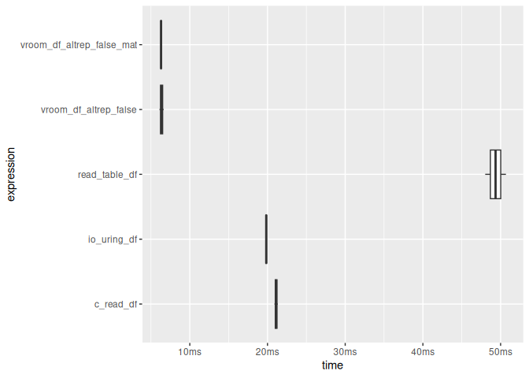

<!-- README.md is generated from README.Rmd. Please edit that file -->

# Rtinycc

Builds `TinyCC` `Cli` and Library For `C` Scripting in `R`

<!-- badges: start -->

[](https://github.com/sounkou-bioinfo/Rtinycc/actions/workflows/R-CMD-check.yaml)
[](https://CRAN.R-project.org/package=Rtinycc)
[](https://sounkou-bioinfo.r-universe.dev/Rtinycc)
<!-- badges: end -->

## Abstract

Rtinycc is an R interface to [TinyCC](https://github.com/TinyCC/tinycc),
providing both CLI access and a libtcc-backed in-memory compiler. It
includes an FFI inspired by [Bun’s
FFI](https://bun.com/docs/runtime/ffi) for binding C symbols with
predictable type conversions and pointer utilities. The package works on
unix-alikes and Windows and focuses on embedding TinyCC and enabling
JIT-compiled bindings directly from R. Combined with
[treesitter.c](https://github.com/sounkou-bioinfo/treesitter.c), which
provides C header parsers, it can be used to rapidly generate
declarative bindings.

## How it works

When you call `tcc_compile()`, Rtinycc generates C wrapper functions
whose signature follows the `.Call` convention (`SEXP` in, `SEXP` out).
These wrappers convert R types to C, call the target function, and
convert the result back. TCC compiles them in-memory – no shared library
is written to disk and no `R_init_*` registration is needed.

After `tcc_relocate()`, wrapper pointers are retrieved via
`tcc_get_symbol()`, which internally calls `RC_libtcc_get_symbol()`.
That function converts TCC’s raw `void*` into a `DL_FUNC` wrapped with
`R_MakeExternalPtrFn` (tagged `"native symbol"`). On the R side,
[`make_callable()`](R/ffi.R) creates a closure that passes this external
pointer to `.Call` (aliased as `.RtinyccCall` to keep `R CMD check`
happy).

The design follows [CFFI’s](https://cffi.readthedocs.io/) API-mode
pattern: instead of computing struct layouts and calling conventions in
R (ABI-mode, like Python’s ctypes), the generated C code lets TCC handle
`sizeof`, `offsetof`, and argument passing. Rtinycc never replicates
platform-specific layout rules. The wrappers can also link against
external shared libraries whose symbols TCC resolves at relocation time.
For background on how this compares to a libffi approach, see the
[`RSimpleFFI`
README](https://github.com/sounkou-bioinfo/RSimpleFFI#readme).

On macOS the configure script strips `-flat_namespace` from TCC’s build
to avoid [BUS ERROR
issues](https://genomic.social/@bioinfhotep/115765645745231377). Without
it, TCC cannot resolve host symbols (e.g. `RC_free_finalizer`) through
the dynamic linker. Rtinycc works around this with
`RC_libtcc_add_host_symbols()`, which registers package-internal C
functions via `tcc_add_symbol()` before relocation. Any new C function
referenced by generated TCC code must be added there.

On Windows, the `configure.win` script generates a UCRT-backed
`msvcrt.def` so TinyCC resolves CRT symbols against `ucrtbase.dll` (R
4.2+ uses UCRT).

Ownership semantics are explicit. Pointers from `tcc_malloc()` are
tagged `rtinycc_owned` and can be released with `tcc_free()` (or by
their R finalizer). Generated struct constructors use a struct-specific
tag (`struct_<name>`) with an `RC_free_finalizer`; free them with
`struct_<name>_free()`, not `tcc_free()`. Pointers from `tcc_data_ptr()`
are tagged `rtinycc_borrowed` and are never freed by Rtinycc. Array
returns are copied into a fresh R vector; set `free = TRUE` only when
the C function returns a `malloc`-owned buffer.

## Installation

``` r
install.packages(
      'Rtinycc', 
        repos = c('https://sounkou-bioinfo.r-universe.dev', 
                  'https://cloud.r-project.org')
        )
```

## Usage

### CLI

The CLI interface compiles C source files to standalone executables
using the bundled TinyCC toolchain.

``` r
library(Rtinycc)

src <- system.file("c_examples", "forty_two.c", package = "Rtinycc")
exe <- tempfile()
tcc_run_cli(c(
  "-B", tcc_prefix(),
  paste0("-I", tcc_include_paths()),
  paste0("-L", tcc_lib_paths()),
  src, "-o", exe
))
#> [1] 0
Sys.chmod(exe, mode = "0755")
system2(exe, stdout = TRUE)
#> [1] "42"
```

For in-memory workflows, prefer libtcc instead.

### In-memory compilation with libtcc

We can compile and call C functions entirely in memory. This is the
simplest path for quick JIT compilation.

``` r
state <- tcc_state(output = "memory")
tcc_compile_string(state, "int forty_two(){ return 42; }")
#> [1] 0
tcc_relocate(state)
#> [1] 0
tcc_call_symbol(state, "forty_two", return = "int")
#> [1] 42
```

For low-level pointer-style calls, `tcc_call_symbol()` can also use an R
`.C()`-like convention: call a `void` C routine with pointers to copied
argument buffers, then return a list of the modified values.

``` r
state <- tcc_state(output = "memory")
tcc_compile_string(state, "void add_one(int *x) { x[0] += 1; }")
#> [1] 0
tcc_relocate(state)
#> [1] 0
tcc_call_symbol(state, "add_one", x = as.integer(41))
#> $x
#> [1] 42
```

The lower-level API gives full control over include paths, libraries,
and the R C API. Using `#define _Complex` as a workaround for TCC’s lack
of [complex type
support](https://lists.gnu.org/archive/html/tinycc-devel/2022-04/msg00020.html),
we can link against R’s headers and call into `libR`.

``` r
state <- tcc_state(output = "memory")
tcc_add_include_path(state, R.home("include"))
#> [1] 0
tcc_add_library_path(state, R.home("lib"))
#> [1] 0

code <- '
#define _Complex
#include <R.h>
#include <Rinternals.h>

double call_r_sqrt(void) {
  SEXP fn   = PROTECT(Rf_findFun(Rf_install("sqrt"), R_BaseEnv));
  SEXP val  = PROTECT(Rf_ScalarReal(16.0));
  SEXP call = PROTECT(Rf_lang2(fn, val));
  SEXP out  = PROTECT(Rf_eval(call, R_GlobalEnv));
  double res = REAL(out)[0];
  UNPROTECT(4);
  return res;
}
'
tcc_compile_string(state, code)
#> [1] 0
tcc_relocate(state)
#> [1] 0
tcc_call_symbol(state, "call_r_sqrt", return = "double")
#> [1] 4
```

### Pointer utilities

Rtinycc ships a set of typed memory access functions similar to what the
[ctypesio](https://cran.r-project.org/package=ctypesio) package offers,
but designed around our FFI pointer model. Every scalar C type has a
corresponding `tcc_read_*` / `tcc_write_*` pair that operates at a byte
offset into any external pointer, so you can walk structs, arrays, and
output parameters without writing C helpers.

``` r
ptr <- tcc_cstring("hello")
tcc_read_cstring(ptr)
#> [1] "hello"
tcc_read_bytes(ptr, 5)
#> [1] 68 65 6c 6c 6f
tcc_ptr_addr(ptr, hex = TRUE)
#> [1] "0x6538652f7850"
tcc_ptr_is_null(ptr)
#> [1] FALSE
tcc_free(ptr)
#> NULL
```

Typed reads and writes cover the full scalar range (`i8`/`u8`,
`i16`/`u16`, `i32`/`u32`, `i64`/`u64`, `f32`/`f64`) plus pointer
dereferencing via `tcc_read_ptr` / `tcc_write_ptr`. All operations use a
byte offset and `memcpy` internally for alignment safety.

``` r
buf <- tcc_malloc(32)
tcc_write_i32(buf, 0L, 42L)
tcc_write_f64(buf, 8L, pi)
tcc_read_i32(buf, offset = 0L)
#> [1] 42
tcc_read_f64(buf, offset = 8L)
#> [1] 3.141593
tcc_free(buf)
#> NULL
```

Pointer-to-pointer workflows are supported for C APIs that return values
through output parameters.

``` r
ptr_ref <- tcc_malloc(.Machine$sizeof.pointer %||% 8L)
target <- tcc_malloc(8)
tcc_ptr_set(ptr_ref, target)
#> <pointer: 0x6538652f7850>
tcc_data_ptr(ptr_ref)
#> <pointer: 0x653866def2f0>
tcc_ptr_set(ptr_ref, tcc_null_ptr())
#> <pointer: 0x6538652f7850>
tcc_free(target)
#> NULL
tcc_free(ptr_ref)
#> NULL
```

## Declarative FFI

A declarative interface inspired by [Bun’s
FFI](https://bun.com/docs/runtime/ffi) sits on top of the lower-level
API. We define types explicitly and Rtinycc generates the binding code,
compiling it in memory with TCC.

### Type system

The FFI exposes a small set of type mappings between R and C.
Conversions are explicit and predictable so callers know when data is
shared versus copied.

The scalar type names are C-facing, but the R-side carriers are not all
one-to-one with those C widths:

- `i8`, `i16`, `i32`, `u8`, and `u16` are mediated through R integer
  scalars
- `u32`, `i64`, `u64`, `f32`, and `f64` are mediated through R numeric
  (`double`) coercion and boxing
- `bool` uses R logical
- `cstring` uses an R character scalar

This means `u32` is routed through `double` to preserve the full
unsigned 32-bit range, and `i64` / `u64` are only exact up to `2^53` on
the R side.

Array arguments pass R vectors to C with zero copy: `raw` maps to
`uint8_t*`, `integer_array` to `int32_t*`, `numeric_array` to `double*`.

Pointer types include `ptr` (opaque external pointer), `sexp` (pass a
`SEXP` directly), and callback signatures like
`callback:double(double)`.

Variadic functions are supported in two forms: typed prefix tails
(`varargs`) and bounded dynamic tails (`varargs_types` +
`varargs_min`/`varargs_max`). Prefix mode is the cheaper runtime path
because dispatch is by tail arity only; bounded dynamic mode adds
per-call scalar type inference to select a compatible wrapper. For hot
loops, prefer fixed arity first, then prefix variadics with a tight
maximum tail size.

Array returns use
`returns = list(type = "integer_array", length_arg = 2, free = TRUE)` to
copy the result into a new R vector. The `length_arg` is the 1-based
index of the C argument that carries the array length. Set `free = TRUE`
when the C function returns a `malloc`-owned buffer.

### Simple functions

``` r
ffi <- tcc_ffi() |>
  tcc_source("
    int add(int a, int b) { return a + b; }
  ") |>
  tcc_bind(add = list(args = list("i32", "i32"), returns = "i32")) |>
  tcc_compile()

ffi$add(5L, 3L)
#> [1] 8
```

### Variadic calls (e.g. `Rprintf` style)

Rtinycc supports two ways to bind variadic tails. The legacy approach
uses `varargs` as a typed prefix tail, while the bounded dynamic
approach uses `varargs_types` together with `varargs_min` and
`varargs_max`. In the bounded mode, wrappers are generated across the
allowed arity and type combinations, and runtime dispatch selects the
matching wrapper from the scalar tail values provided at call time.

``` r
ffi_var <- tcc_ffi() |>
  tcc_header("#include <R_ext/Print.h>") |>
  tcc_source('
    #include <stdarg.h>

    int sum_fmt(int n, ...) {
      va_list ap;
      va_start(ap, n);
      int s = 0;
      for (int i = 0; i < n; i++) s += va_arg(ap, int);
      va_end(ap);
      Rprintf("sum_fmt(%d) = %d\\n", n, s);
      return s;
    }
  ') |>
  tcc_bind(
    Rprintf = list(
      args = list("cstring"),
      variadic = TRUE,
      varargs_types = list("i32"),
      varargs_min = 0L,
      varargs_max = 4L,
      returns = "void"
    ),
    sum_fmt = list(
      args = list("i32"),
      variadic = TRUE,
      varargs_types = list("i32"),
      varargs_min = 0L,
      varargs_max = 4L,
      returns = "i32"
    )
  ) |>
  tcc_compile()

ffi_var$Rprintf("Rprintf via bind: %d + %d = %d\n", 2L, 3L, 5L)
#> Rprintf via bind: 2 + 3 = 5
#> NULL
ffi_var$sum_fmt(0L)
#> sum_fmt(0) = 0
#> [1] 0
ffi_var$sum_fmt(2L, 10L, 20L)
#> sum_fmt(2) = 30
#> [1] 30
ffi_var$sum_fmt(4L, 1L, 2L, 3L, 4L)
#> sum_fmt(4) = 10
#> [1] 10
```

### Linking external libraries

We can bind directly to symbols in shared libraries. Here we link
against `libm`.

``` r
math <- tcc_ffi() |>
  tcc_library("m") |>
  tcc_bind(
    sqrt  = list(args = list("f64"), returns = "f64"),
    sin   = list(args = list("f64"), returns = "f64"),
    floor = list(args = list("f64"), returns = "f64")
  ) |>
  tcc_compile()

math$sqrt(16.0)
#> [1] 4
math$sin(pi / 2)
#> [1] 1
math$floor(3.7)
#> [1] 3
```

### Compiler options

Use `tcc_options()` to pass raw TinyCC options in the high-level FFI
pipeline. For low-level states, use `tcc_set_options()` directly.

``` r
ffi_opt_off <- tcc_ffi() |>
  tcc_options("-O0") |>
  tcc_source('
    int opt_macro() {
    #ifdef __OPTIMIZE__
      return 1;
    #else
      return 0;
    #endif
    }
  ') |>
  tcc_bind(opt_macro = list(args = list(), returns = "i32")) |>
  tcc_compile()

ffi_opt_on <- tcc_ffi() |>
  tcc_options(c("-Wall", "-O2")) |>
  tcc_source('
    int opt_macro() {
    #ifdef __OPTIMIZE__
      return 1;
    #else
      return 0;
    #endif
    }
  ') |>
  tcc_bind(opt_macro = list(args = list(), returns = "i32")) |>
  tcc_compile()

ffi_opt_off$opt_macro()
#> [1] 0
ffi_opt_on$opt_macro()
#> [1] 1
```

### Working with arrays

R vectors are passed to C with zero copy. Mutations in C are visible in
R.

``` r
ffi <- tcc_ffi() |>
  tcc_source("
    #include <stdlib.h>
    #include <string.h>

    int64_t sum_array(int32_t* arr, int32_t n) {
      int64_t s = 0;
      for (int i = 0; i < n; i++) s += arr[i];
      return s;
    }

    void bump_first(int32_t* arr) { arr[0] += 10; }

    int32_t* dup_array(int32_t* arr, int32_t n) {
      int32_t* out = malloc(sizeof(int32_t) * n);
      memcpy(out, arr, sizeof(int32_t) * n);
      return out;
    }
  ") |>
  tcc_bind(
    sum_array  = list(args = list("integer_array", "i32"), returns = "i64"),
    bump_first = list(args = list("integer_array"), returns = "void"),
    dup_array  = list(
      args = list("integer_array", "i32"),
      returns = list(type = "integer_array", length_arg = 2, free = TRUE)
    )
  ) |>
  tcc_compile()

x <- as.integer(1:100) # to avoid ALTREP
.Internal(inspect(x))
#> @653868b6d278 13 INTSXP g0c0 [REF(65535)]  1 : 100 (compact)
ffi$sum_array(x, length(x))
#> [1] 5050

# Zero-copy: C mutation reflects in R
ffi$bump_first(x)
#> NULL
x[1]
#> [1] 11

# Array return: copied into a new R vector, C buffer freed
y <- ffi$dup_array(x, length(x))
y[1]
#> [1] 11

.Internal(inspect(x))
#> @653868b6d278 13 INTSXP g0c0 [REF(65535)]  11 : 110 (expanded)
```

## Advanced FFI features

### Structs and unions

Complex C types are supported declaratively. Use `tcc_struct()` to
generate allocation and accessor helpers. Free instances when done.

``` r
ffi <- tcc_ffi() |>
  tcc_source('
    #include <math.h>
    struct point { double x; double y; };
    double distance(struct point* a, struct point* b) {
      double dx = a->x - b->x, dy = a->y - b->y;
      return sqrt(dx * dx + dy * dy);
    }
  ') |>
  tcc_library("m") |>
  tcc_struct("point", accessors = c(x = "f64", y = "f64")) |>
  tcc_bind(distance = list(args = list("ptr", "ptr"), returns = "f64")) |>
  tcc_compile()

p1 <- ffi$struct_point_new()
ffi$struct_point_set_x(p1, 0.0)
#> <pointer: 0x653866dbd710>
ffi$struct_point_set_y(p1, 0.0)
#> <pointer: 0x653866dbd710>

p2 <- ffi$struct_point_new()
ffi$struct_point_set_x(p2, 3.0)
#> <pointer: 0x653866c5a820>
ffi$struct_point_set_y(p2, 4.0)
#> <pointer: 0x653866c5a820>

ffi$distance(p1, p2)
#> [1] 5

ffi$struct_point_free(p1)
#> NULL
ffi$struct_point_free(p2)
#> NULL
```

### Enums

Enums are exposed as helper functions that return integer constants.

``` r
ffi <- tcc_ffi() |>
  tcc_source("enum color { RED = 0, GREEN = 1, BLUE = 2 };") |>
  tcc_enum("color", constants = c("RED", "GREEN", "BLUE")) |>
  tcc_compile()

ffi$enum_color_RED()
#> [1] 0
ffi$enum_color_BLUE()
#> [1] 2
```

### Bitfields

Bitfields are handled by TCC. Accessors read and write them like normal
fields.

``` r
ffi <- tcc_ffi() |>
  tcc_source("
    struct flags {
      unsigned int active : 1;
      unsigned int level  : 4;
    };
  ") |>
  tcc_struct("flags", accessors = c(active = "u8", level = "u8")) |>
  tcc_compile()

s <- ffi$struct_flags_new()
ffi$struct_flags_set_active(s, 1L)
#> <pointer: 0x65386b1a9c50>
ffi$struct_flags_set_level(s, 9L)
#> <pointer: 0x65386b1a9c50>
ffi$struct_flags_get_active(s)
#> [1] 1
ffi$struct_flags_get_level(s)
#> [1] 9
ffi$struct_flags_free(s)
#> NULL
```

### Global getters and setters

C globals can be exposed with explicit getter/setter helpers.

``` r
ffi <- tcc_ffi() |>
  tcc_source("
    int counter = 7;
    double pi_approx = 3.14159;
  ") |>
  tcc_global("counter", "i32") |>
  tcc_global("pi_approx", "f64") |>
  tcc_compile()

ffi$global_counter_get()
#> [1] 7
ffi$global_pi_approx_get()
#> [1] 3.14159
ffi$global_counter_set(42L)
#> [1] 42
ffi$global_counter_get()
#> [1] 42
```

### Callbacks

R functions can be registered as C function pointers via
`tcc_callback()` and passed to compiled code. Specify a
`callback:<signature>` argument in `tcc_bind()` so the trampoline is
generated automatically. Call `tcc_callback_close()` when you want
deterministic invalidation and earlier release of the preserved R
function.

``` r
cb <- tcc_callback(function(x) x * x, signature = "double (*)(double)")

code <- '
double apply_fn(double (*fn)(void* ctx, double), void* ctx, double x) {
  return fn(ctx, x);
}
'

ffi <- tcc_ffi() |>
  tcc_source(code) |>
  tcc_bind(
    apply_fn = list(
      args = list("callback:double(double)", "ptr", "f64"),
      returns = "f64"
    )
  ) |>
  tcc_compile()

ffi$apply_fn(cb, tcc_callback_ptr(cb), 7.0)
#> [1] 49
tcc_callback_close(cb)
```

### Callback errors

If a callback throws an R error, the trampoline catches it, emits a
warning, and returns a type-appropriate sentinel instead of unwinding
through C. In practice this means NA-like numeric or integer values,
`NA` logical, `NULL` for `cstring`, or a null external pointer depending
on the declared return type.

``` r
cb_err <- tcc_callback(
  function(x) stop("boom"),
  signature = "double (*)(double)"
)

ffi_err <- tcc_ffi() |>
  tcc_source('
    double call_cb_err(double (*cb)(void* ctx, double), void* ctx, double x) {
      return cb(ctx, x);
    }
  ') |>
  tcc_bind(
    call_cb_err = list(
      args = list("callback:double(double)", "ptr", "f64"),
      returns = "f64"
    )
  ) |>
  tcc_compile()

warned <- FALSE
res <- withCallingHandlers(
  ffi_err$call_cb_err(cb_err, tcc_callback_ptr(cb_err), 1.0),
  warning = function(w) {
    warned <<- TRUE
    invokeRestart("muffleWarning")
  }
)
list(warned = warned, result = res)
#> $warned
#> [1] TRUE
#> 
#> $result
#> [1] NA
tcc_callback_close(cb_err)
```

### Async callbacks

For thread-safe scheduling from worker threads, use
`callback_async:<signature>` in `tcc_bind()`. The async callback queue
is initialized automatically at package load.

When a bound function has any `callback_async:` argument, the generated
wrapper automatically runs your C function on a new thread while
draining callbacks on the main R thread. Your C code doesn’t need to
know about draining at all — just call the callback as normal and the
wrapper handles the rest.

**Void return (fire-and-forget):** the callback is enqueued from any
thread and executed on the main R thread automatically — on Windows via
R’s message pump, on Linux/macOS via R’s event loop `addInputHandler`.

**Non-void return (synchronous):** the worker thread blocks until the
main R thread executes the callback and returns the real result.
Supported return types: integer variants (`int`, `int32_t`, `i8`, `i16`,
`u8`, `u16`), floating-point (`double`, `float`), `bool`/`logical`, and
pointer (`void*`, `T*`).

``` r
# Fire-and-forget: void callback accumulated from 100 worker threads
hits <- 0L
cb_async <- tcc_callback(
  function(x) { hits <<- hits + x; NULL },
  signature = "void (*)(int)"
)

code_async <- '
struct task { void (*cb)(void* ctx, int); void* ctx; int value; };

#ifdef _WIN32
#include <windows.h>

static DWORD WINAPI worker(LPVOID data) {
  struct task* t = (struct task*) data;
  t->cb(t->ctx, t->value);
  return 0;
}

int spawn_async(void (*cb)(void* ctx, int), void* ctx, int value) {
  if (!cb || !ctx) return -1;
  struct task t;
  t.cb = cb;
  t.ctx = ctx;
  t.value = value;
  HANDLE th = CreateThread(NULL, 0, worker, &t, 0, NULL);
  if (!th) return -2;
  WaitForSingleObject(th, INFINITE);
  CloseHandle(th);
  return 0;
}
#else
#include <pthread.h>

static void* worker(void* data) {
  struct task* t = (struct task*) data;
  t->cb(t->ctx, t->value);
  return NULL;
}

int spawn_async(void (*cb)(void* ctx, int), void* ctx, int value) {
  if (!cb || !ctx) return -1;
  const int n = 100;
  struct task tasks[100];
  pthread_t th[100];
  for (int i = 0; i < n; i++) {
    tasks[i].cb = cb;
    tasks[i].ctx = ctx;
    tasks[i].value = value;
    if (pthread_create(&th[i], NULL, worker, &tasks[i]) != 0) {
      for (int j = 0; j < i; j++) pthread_join(th[j], NULL);
      return -2;
    }
  }
  for (int i = 0; i < n; i++) pthread_join(th[i], NULL);
  return 0;
}
#endif
'

ffi_async <- tcc_ffi() |>
  tcc_source(code_async)
if (.Platform$OS.type != "windows") {
  ffi_async <- tcc_library(ffi_async, "pthread")
}
ffi_async <- ffi_async |>
  tcc_bind(
    spawn_async = list(
      args = list("callback_async:void(int)", "ptr", "i32"),
      returns = "i32"
    )
  ) |>
  tcc_compile()

rc <- ffi_async$spawn_async(cb_async, tcc_callback_ptr(cb_async), 2L)
hits
#> [1] 200
tcc_callback_close(cb_async)
```

Non-void return works the same way — the generated wrapper handles the
drain loop transparently:

``` r
cb_triple <- tcc_callback(
  function(x) x * 3L,
  signature = "int (*)(int)"
)

# Pure C: the worker calls the sync callback and returns its result.
# No drain logic needed — the generated wrapper handles it.
code_sync <- '
#ifdef _WIN32
#include <windows.h>

struct itask { int (*cb)(void*,int); void* ctx; int in; int out; };

static DWORD WINAPI iworker(LPVOID p) {
  struct itask* t = (struct itask*)p;
  t->out = t->cb(t->ctx, t->in);
  return 0;
}
int run_worker(int (*cb)(void*,int), void* ctx, int x) {
  struct itask t;
  t.cb = cb; t.ctx = ctx; t.in = x; t.out = -1;
  HANDLE th = CreateThread(NULL, 0, iworker, &t, 0, NULL);
  if (!th) return -1;
  WaitForSingleObject(th, INFINITE);
  CloseHandle(th);
  return t.out;
}
#else
#include <pthread.h>

struct itask { int (*cb)(void*,int); void* ctx; int in; int out; };

static void* iworker(void* p) {
  struct itask* t = (struct itask*)p;
  t->out = t->cb(t->ctx, t->in);
  return NULL;
}
int run_worker(int (*cb)(void*,int), void* ctx, int x) {
  struct itask t;
  t.cb = cb; t.ctx = ctx; t.in = x; t.out = -1;
  pthread_t th;
  if (pthread_create(&th, NULL, iworker, &t) != 0) return -1;
  pthread_join(th, NULL);
  return t.out;
}
#endif
'

ffi_sync <- tcc_ffi() |>
  tcc_source(code_sync)
if (.Platform$OS.type != "windows") {
  ffi_sync <- tcc_library(ffi_sync, "pthread")
}
ffi_sync <- ffi_sync |>
  tcc_bind(
    run_worker = list(args = list("callback_async:int(int)", "ptr", "i32"), returns = "i32")
  ) |>
  tcc_compile()

ffi_sync$run_worker(cb_triple, tcc_callback_ptr(cb_triple), 7L)  # 21
#> [1] 21
tcc_callback_close(cb_triple)
```

### SQLite: a complete example

This example ties together external library linking, callbacks, and
pointer dereferencing. We open an in-memory SQLite database, execute
queries, and collect rows through an R callback that reads `char**`
arrays using `tcc_read_ptr` and `tcc_read_cstring`.

``` r
ptr_size <- .Machine$sizeof.pointer

read_string_array <- function(ptr, n) {
  vapply(seq_len(n), function(i) {
    tcc_read_cstring(tcc_read_ptr(ptr, (i - 1L) * ptr_size))
  }, "")
}

cb <- tcc_callback(
  function(argc, argv, cols) {
    values <- read_string_array(argv, argc)
    names  <- read_string_array(cols, argc)
    cat(paste(names, values, sep = " = ", collapse = ", "), "\n")
    0L
  },
  signature = "int (*)(int, char **, char **)"
)

sqlite <- tcc_ffi() |>
  tcc_header("#include <sqlite3.h>") |>
  tcc_library("sqlite3") |>
  tcc_source('
    void* open_db() {
      sqlite3* db = NULL;
      sqlite3_open(":memory:", &db);
      return db;
    }
    int close_db(void* db) {
      return sqlite3_close((sqlite3*)db);
    }
  ') |>
  tcc_bind(
    open_db  = list(args = list(), returns = "ptr"),
    close_db = list(args = list("ptr"), returns = "i32"),
    sqlite3_libversion = list(args = list(), returns = "cstring"),
    sqlite3_exec = list(
      args = list("ptr", "cstring", "callback:int(int, char **, char **)", "ptr", "ptr"),
      returns = "i32"
    )
  ) |>
  tcc_compile()

sqlite$sqlite3_libversion()
#> [1] "3.45.1"

db <- sqlite$open_db()
sqlite$sqlite3_exec(db, "CREATE TABLE t (id INTEGER, name TEXT);", cb, tcc_callback_ptr(cb), tcc_null_ptr())
#> [1] 0
sqlite$sqlite3_exec(db, "INSERT INTO t VALUES (1, 'hello'), (2, 'world');", cb, tcc_callback_ptr(cb), tcc_null_ptr())
#> [1] 0
sqlite$sqlite3_exec(db, "SELECT * FROM t;", cb, tcc_callback_ptr(cb), tcc_null_ptr())
#> id = 1, name = hello 
#> id = 2, name = world
#> [1] 0
sqlite$close_db(db)
#> [1] 0
tcc_callback_close(cb)
```

### Stackless C Protothreads: streaming BCF/VCF records with htslib

Rtinycc bundles Adam Dunkels’
[Protothreads](http://dunkels.com/adam/pt/) library, allowing you to
JIT-compile cross-platform native iterators that yield back to R. This
demo binds [htslib](https://www.htslib.org/) using a protothread: R
resumes the C reader until the next `bcf1_t` is ready, then copies the
current fields into a regular R list. The C logic never blocks R’s event
loop, and R objects are created only after control returns safely to the
main R stack.

**Important Protothreads Limitations:** Because protothreads are
stackless (implemented using Duff’s device macro expansions), you must
observe a few strict rules in your C code:

1.  **Local variables are NOT preserved** across `PT_YIELD` calls. Store
    state in your context struct instead.
2.  **No nested blocking**: You cannot yield from inside a nested C
    function call.
3.  **No switch statements**: Because Protothreads uses `switch`
    internally, you cannot use `switch` within a `PT_THREAD` block.

The demo uses plain VCF text, opened directly by htslib through the same
API as BCF.

``` r
source("scripts/demo-streaming-bcf-reader-ffi.R")
run_streaming_bcf_demo()
#> Rtinycc version: 0.1.11.9000
#> Demo: stackless Protothreads + htslib BCF/VCF API streaming reader
#> Note: htslib reads run using Protothreads. Warning: Local C variables are NOT preserved across yields!; R objects are built only after each yield.
#> 
#> Input: generated VCF text (opened directly by htslib)
#> Samples: sample1
#> 
#> == Streaming records one resume at a time ==
#> record 1: chr1:10 id=rs1 ref=A alt=C qual=50 alleles=[A,C]
#> record 2: chr1:20 id=. ref=G alt=A,T qual=99 alleles=[G,A,T]
#> record 3: chr1:30 id=rs3 ref=TT alt=T qual=. alleles=[TT,T]
#> done_after_collect=TRUE
```

The full demo source is foldable below.

<details>
<summary>
Click to show the complete
<code>scripts/demo-streaming-bcf-reader-ffi.R</code> script
</summary>

``` r
#!/usr/bin/env Rscript

suppressPackageStartupMessages(library(Rtinycc))


say <- function(...) cat(..., "\n", sep = "")

`%||%` <- function(x, y) if (is.null(x)) y else x

pkg_config_paths <- function(args, prefix) {
  out <- tryCatch(
    system2("pkg-config", c(args, "htslib"), stdout = TRUE, stderr = FALSE),
    error = function(e) character()
  )
  out <- unlist(strsplit(paste(out, collapse = " "), "[[:space:]]+"))
  out <- out[nzchar(out)]
  sub(paste0("^", prefix), "", out[startsWith(out, prefix)])
}

build_streaming_bcf_ffi <- function() {
  code <- '
#include <rtinycc/pt.h>
#include <stdint.h>
#include <stdlib.h>
#include <string.h>
#include <stdio.h>
#include <math.h>
#include <htslib/hts.h>
#include <htslib/vcf.h>

enum {
  BCF_STREAM_ERR = -1,
  BCF_STREAM_EOF = 0,
  BCF_STREAM_RECORD = 1
};

typedef struct bcf_stream {
  struct pt pt;
  int yielded;
  int started;
  int done;
  int error;
  char err[256];
  htsFile *fp;
  bcf_hdr_t *hdr;
  bcf1_t *rec;
  char *alts;
  size_t alts_cap;
  int ret;
} bcf_stream_t;

static void bcf_stream_set_error(bcf_stream_t *st, const char *msg) {
  if (!st) return;
  if (!msg) msg = "unknown htslib error";
  snprintf(st->err, sizeof(st->err), "%s", msg);
  st->error = 1;
}

static int bcf_stream_resume_internal(bcf_stream_t *st) {
  PT_BEGIN(&st->pt);

  if (!st || !st->fp || !st->hdr || !st->rec) {
    if (st) bcf_stream_set_error(st, "stream is not open");
    if (st) st->done = 1;
    PT_EXIT(&st->pt);
  }

  for (;;) {
    st->ret = bcf_read(st->fp, st->hdr, st->rec);
    if (st->ret == 0) {
      if (bcf_unpack(st->rec, BCF_UN_STR) < 0) {
        bcf_stream_set_error(st, "bcf_unpack() failed");
        st->done = 1;
        st->yielded = BCF_STREAM_ERR;
        PT_EXIT(&st->pt);
      }
      st->yielded = BCF_STREAM_RECORD;
      PT_YIELD(&st->pt);
      if (st->error || st->done) PT_EXIT(&st->pt);
    } else {
      if (st->ret < -1) {
        bcf_stream_set_error(st, "bcf_read() failed");
      }
      st->done = 1;
      st->yielded = BCF_STREAM_EOF;
      PT_EXIT(&st->pt);
    }
  }

  PT_END(&st->pt);
}

void *bcf_stream_open(const char *path) {
  bcf_stream_t *st = (bcf_stream_t *) calloc(1, sizeof(bcf_stream_t));
  if (!st) return NULL;

  PT_INIT(&st->pt);

  if (!path || !path[0]) {
    bcf_stream_set_error(st, "path is empty");
    st->done = 1;
    return st;
  }

  st->fp = hts_open(path, "r");
  if (!st->fp) {
    bcf_stream_set_error(st, "hts_open() failed");
    st->done = 1;
    return st;
  }

  st->hdr = bcf_hdr_read(st->fp);
  if (!st->hdr) {
    bcf_stream_set_error(st, "bcf_hdr_read() failed");
    st->done = 1;
    return st;
  }

  st->rec = bcf_init();
  if (!st->rec) {
    bcf_stream_set_error(st, "bcf_init() failed");
    st->done = 1;
    return st;
  }

  return st;
}

int bcf_stream_resume(void *ptr) {
  bcf_stream_t *st = (bcf_stream_t *) ptr;

  if (!st) return BCF_STREAM_ERR;
  if (st->error) return BCF_STREAM_ERR;
  if (st->done) return BCF_STREAM_EOF;

  st->started = 1;
  bcf_stream_resume_internal(st);

  if (st->error) return BCF_STREAM_ERR;
  if (st->done) return BCF_STREAM_EOF;
  return st->yielded;
}

int bcf_stream_done(void *ptr) {
  bcf_stream_t *st = (bcf_stream_t *) ptr;
  return st ? st->done : 1;
}

const char *bcf_stream_error(void *ptr) {
  bcf_stream_t *st = (bcf_stream_t *) ptr;
  if (!st) return "stream pointer is NULL";
  return st->err[0] ? st->err : NULL;
}

const char *bcf_stream_chrom(void *ptr) {
  bcf_stream_t *st = (bcf_stream_t *) ptr;
  if (!st || !st->hdr || !st->rec) return NULL;
  return bcf_seqname(st->hdr, st->rec);
}

int64_t bcf_stream_pos1(void *ptr) {
  bcf_stream_t *st = (bcf_stream_t *) ptr;
  if (!st || !st->rec) return -1;
  return (int64_t) st->rec->pos + 1;
}

int64_t bcf_stream_end1(void *ptr) {
  bcf_stream_t *st = (bcf_stream_t *) ptr;
  if (!st || !st->rec) return -1;
  return (int64_t) st->rec->pos + (int64_t) st->rec->rlen;
}

const char *bcf_stream_id(void *ptr) {
  bcf_stream_t *st = (bcf_stream_t *) ptr;
  if (!st || !st->rec || !st->rec->d.id || !st->rec->d.id[0]) return ".";
  return st->rec->d.id;
}

int bcf_stream_n_allele(void *ptr) {
  bcf_stream_t *st = (bcf_stream_t *) ptr;
  if (!st || !st->rec) return 0;
  return st->rec->n_allele;
}

const char *bcf_stream_allele(void *ptr, int idx) {
  bcf_stream_t *st = (bcf_stream_t *) ptr;
  if (!st || !st->rec || idx < 0 || idx >= st->rec->n_allele) return NULL;
  return st->rec->d.allele[idx];
}

const char *bcf_stream_ref(void *ptr) {
  return bcf_stream_allele(ptr, 0);
}

const char *bcf_stream_alt(void *ptr) {
  bcf_stream_t *st = (bcf_stream_t *) ptr;
  size_t need = 2;
  int i;

  if (!st || !st->rec) return NULL;
  if (st->rec->n_allele <= 1) return ".";

  for (i = 1; i < st->rec->n_allele; ++i) {
    const char *a = st->rec->d.allele[i] ? st->rec->d.allele[i] : "";
    need += strlen(a) + 1;
  }

  if (need > st->alts_cap) {
    char *tmp = (char *) realloc(st->alts, need);
    if (!tmp) {
      bcf_stream_set_error(st, "failed to allocate ALT buffer");
      return NULL;
    }
    st->alts = tmp;
    st->alts_cap = need;
  }

  st->alts[0] = 0;
  for (i = 1; i < st->rec->n_allele; ++i) {
    if (i > 1) strcat(st->alts, ",");
    strcat(st->alts, st->rec->d.allele[i] ? st->rec->d.allele[i] : "");
  }

  return st->alts;
}

double bcf_stream_qual(void *ptr) {
  bcf_stream_t *st = (bcf_stream_t *) ptr;
  if (!st || !st->rec || bcf_float_is_missing(st->rec->qual)) return NAN;
  return (double) st->rec->qual;
}

int bcf_stream_nsamples(void *ptr) {
  bcf_stream_t *st = (bcf_stream_t *) ptr;
  if (!st || !st->hdr) return 0;
  return bcf_hdr_nsamples(st->hdr);
}

const char *bcf_stream_sample(void *ptr, int idx) {
  bcf_stream_t *st = (bcf_stream_t *) ptr;
  if (!st || !st->hdr || idx < 0 || idx >= bcf_hdr_nsamples(st->hdr)) return NULL;
  return st->hdr->samples[idx];
}

void bcf_stream_close(void *ptr) {
  bcf_stream_t *st = (bcf_stream_t *) ptr;

  if (!st) return;

  if (st->rec) bcf_destroy(st->rec);
  if (st->hdr) bcf_hdr_destroy(st->hdr);
  if (st->fp) hts_close(st->fp);
  free(st->alts);
  memset(st, 0, sizeof(bcf_stream_t));
  free(st);
}
'

  ffi <- tcc_ffi()
  ffi <- tcc_include(ffi, system.file("include", package = "Rtinycc"))

  for (path in pkg_config_paths("--cflags-only-I", "-I")) {
    ffi <- tcc_include(ffi, path)
  }
  for (path in pkg_config_paths("--libs-only-L", "-L")) {
    ffi <- tcc_library_path(ffi, path)
  }

  ffi |>
    tcc_source(code) |>
    tcc_library("hts") |>
    tcc_bind(
      bcf_stream_open = list(args = list("cstring"), returns = "ptr"),
      bcf_stream_resume = list(args = list("ptr"), returns = "i32"),
      bcf_stream_done = list(args = list("ptr"), returns = "bool"),
      bcf_stream_error = list(args = list("ptr"), returns = "cstring"),
      bcf_stream_chrom = list(args = list("ptr"), returns = "cstring"),
      bcf_stream_pos1 = list(args = list("ptr"), returns = "i64"),
      bcf_stream_end1 = list(args = list("ptr"), returns = "i64"),
      bcf_stream_id = list(args = list("ptr"), returns = "cstring"),
      bcf_stream_n_allele = list(args = list("ptr"), returns = "i32"),
      bcf_stream_allele = list(args = list("ptr", "i32"), returns = "cstring"),
      bcf_stream_ref = list(args = list("ptr"), returns = "cstring"),
      bcf_stream_alt = list(args = list("ptr"), returns = "cstring"),
      bcf_stream_qual = list(args = list("ptr"), returns = "f64"),
      bcf_stream_nsamples = list(args = list("ptr"), returns = "i32"),
      bcf_stream_sample = list(args = list("ptr", "i32"), returns = "cstring"),
      bcf_stream_close = list(args = list("ptr"), returns = "void")
    ) |>
    tcc_compile()
}

new_bcf_reader <- function(path, ffi = build_streaming_bcf_ffi()) {
  path <- normalizePath(path, mustWork = TRUE)
  ptr <- ffi$bcf_stream_open(path)
  if (tcc_ptr_is_null(ptr)) {
    stop("failed to allocate BCF stream", call. = FALSE)
  }

  err <- ffi$bcf_stream_error(ptr)
  if (!is.null(err)) {
    ffi$bcf_stream_close(ptr)
    stop(err, call. = FALSE)
  }

  reader <- new.env(parent = emptyenv())
  reader$ffi <- ffi
  reader$ptr <- ptr
  reader$closed <- FALSE
  class(reader) <- "bcf_stream_reader"

  reg.finalizer(reader, function(x) {
    if (!isTRUE(x$closed)) {
      x$ffi$bcf_stream_close(x$ptr)
      x$closed <- TRUE
    }
  }, onexit = TRUE)

  reader
}

close.bcf_stream_reader <- function(con, ...) {
  if (!inherits(con, "bcf_stream_reader")) {
    stop("expected a bcf_stream_reader", call. = FALSE)
  }
  if (!isTRUE(con$closed)) {
    con$ffi$bcf_stream_close(con$ptr)
    con$closed <- TRUE
  }
  invisible(NULL)
}

bcf_reader_samples <- function(reader) {
  stopifnot(inherits(reader, "bcf_stream_reader"), !isTRUE(reader$closed))
  n <- reader$ffi$bcf_stream_nsamples(reader$ptr)
  if (n <= 0L) return(character())
  vapply(seq_len(n) - 1L, function(i) reader$ffi$bcf_stream_sample(reader$ptr, i), "")
}

bcf_reader_next <- function(reader) {
  stopifnot(inherits(reader, "bcf_stream_reader"), !isTRUE(reader$closed))

  status <- reader$ffi$bcf_stream_resume(reader$ptr)
  if (identical(status, 0L)) {
    return(NULL)
  }
  if (identical(status, -1L)) {
    err <- reader$ffi$bcf_stream_error(reader$ptr) %||% "BCF stream failed"
    stop(err, call. = FALSE)
  }

  n_allele <- reader$ffi$bcf_stream_n_allele(reader$ptr)
  alleles <- if (n_allele > 0L) {
    vapply(seq_len(n_allele) - 1L, function(i) {
      reader$ffi$bcf_stream_allele(reader$ptr, i) %||% NA_character_
    }, "")
  } else {
    character()
  }

  list(
    chrom = reader$ffi$bcf_stream_chrom(reader$ptr),
    pos = reader$ffi$bcf_stream_pos1(reader$ptr),
    end = reader$ffi$bcf_stream_end1(reader$ptr),
    id = reader$ffi$bcf_stream_id(reader$ptr),
    ref = reader$ffi$bcf_stream_ref(reader$ptr),
    alt = reader$ffi$bcf_stream_alt(reader$ptr),
    qual = reader$ffi$bcf_stream_qual(reader$ptr),
    alleles = alleles
  )
}

bcf_reader_collect <- function(reader, n = Inf) {
  out <- list()
  i <- 0L
  repeat {
    if (i >= n) break
    rec <- bcf_reader_next(reader)
    if (is.null(rec)) break
    i <- i + 1L
    out[[i]] <- rec
  }
  out
}

write_demo_vcf <- function(path) {
  lines <- c(
    "##fileformat=VCFv4.3",
    "##contig=<ID=chr1,length=1000>",
    "##FORMAT=<ID=GT,Number=1,Type=String,Description=\"Genotype\">",
    "#CHROM\tPOS\tID\tREF\tALT\tQUAL\tFILTER\tINFO\tFORMAT\tsample1",
    "chr1\t10\trs1\tA\tC\t50\tPASS\t.\tGT\t0/1",
    "chr1\t20\t.\tG\tA,T\t99\tPASS\t.\tGT\t1/2",
    "chr1\t30\trs3\tTT\tT\t.\tPASS\t.\tGT\t0/1"
  )
  writeLines(lines, path)
  invisible(path)
}

make_demo_vcf <- function() {
  vcf <- tempfile(fileext = ".vcf")
  write_demo_vcf(vcf)
  vcf
}

run_streaming_bcf_demo <- function() {
  say("Rtinycc version: ", as.character(utils::packageVersion("Rtinycc")))
  say("Demo: stackless Protothreads + htslib BCF/VCF API streaming reader")
  say("Note: htslib reads run using Protothreads. Warning: Local C variables are NOT preserved across yields!; R objects are built only after each yield.")

  ffi <- build_streaming_bcf_ffi()
  path <- make_demo_vcf()

  say("")
  say("Input: generated VCF text (opened directly by htslib)")

  reader <- new_bcf_reader(path, ffi)
  on.exit(close(reader), add = TRUE)

  say("Samples: ", paste(bcf_reader_samples(reader), collapse = ", "))
  say("")
  say("== Streaming records one resume at a time ==")

  i <- 0L
  repeat {
    rec <- bcf_reader_next(reader)
    if (is.null(rec)) break
    i <- i + 1L
    say(
      "record ", i, ": ",
      rec$chrom, ":", rec$pos,
      " id=", rec$id,
      " ref=", rec$ref,
      " alt=", rec$alt,
      " qual=", if (is.nan(rec$qual)) "." else rec$qual,
      " alleles=[", paste(rec$alleles, collapse = ","), "]"
    )
  }

  say("done_after_collect=", isTRUE(ffi$bcf_stream_done(reader$ptr)))
  invisible(NULL)
}

if (identical(sys.nframe(), 0L)) {
  run_streaming_bcf_demo()
}
```

</details>

The embedded htslib Protothreads C source is extracted from the script
and rendered with the same Rtinycc C-code display helper used by the
vignettes.

<details>
<summary>
Click to show only the embedded C Protothreads / htslib source
</summary>

``` c
#include <rtinycc/pt.h>
#include <stdint.h>
#include <stdlib.h>
#include <string.h>
#include <stdio.h>
#include <math.h>
#include <htslib/hts.h>
#include <htslib/vcf.h>

enum {
  BCF_STREAM_ERR = -1,
  BCF_STREAM_EOF = 0,
  BCF_STREAM_RECORD = 1
};

typedef struct bcf_stream {
  struct pt pt;
  int yielded;
  int started;
  int done;
  int error;
  char err[256];
  htsFile *fp;
  bcf_hdr_t *hdr;
  bcf1_t *rec;
  char *alts;
  size_t alts_cap;
  int ret;
} bcf_stream_t;

static void bcf_stream_set_error(bcf_stream_t *st, const char *msg) {
  if (!st) return;
  if (!msg) msg = "unknown htslib error";
  snprintf(st->err, sizeof(st->err), "%s", msg);
  st->error = 1;
}

static int bcf_stream_resume_internal(bcf_stream_t *st) {
  PT_BEGIN(&st->pt);

  if (!st || !st->fp || !st->hdr || !st->rec) {
    if (st) bcf_stream_set_error(st, "stream is not open");
    if (st) st->done = 1;
    PT_EXIT(&st->pt);
  }

  for (;;) {
    st->ret = bcf_read(st->fp, st->hdr, st->rec);
    if (st->ret == 0) {
      if (bcf_unpack(st->rec, BCF_UN_STR) < 0) {
        bcf_stream_set_error(st, "bcf_unpack() failed");
        st->done = 1;
        st->yielded = BCF_STREAM_ERR;
        PT_EXIT(&st->pt);
      }
      st->yielded = BCF_STREAM_RECORD;
      PT_YIELD(&st->pt);
      if (st->error || st->done) PT_EXIT(&st->pt);
    } else {
      if (st->ret < -1) {
        bcf_stream_set_error(st, "bcf_read() failed");
      }
      st->done = 1;
      st->yielded = BCF_STREAM_EOF;
      PT_EXIT(&st->pt);
    }
  }

  PT_END(&st->pt);
}

void *bcf_stream_open(const char *path) {
  bcf_stream_t *st = (bcf_stream_t *) calloc(1, sizeof(bcf_stream_t));
  if (!st) return NULL;

  PT_INIT(&st->pt);

  if (!path || !path[0]) {
    bcf_stream_set_error(st, "path is empty");
    st->done = 1;
    return st;
  }

  st->fp = hts_open(path, "r");
  if (!st->fp) {
    bcf_stream_set_error(st, "hts_open() failed");
    st->done = 1;
    return st;
  }

  st->hdr = bcf_hdr_read(st->fp);
  if (!st->hdr) {
    bcf_stream_set_error(st, "bcf_hdr_read() failed");
    st->done = 1;
    return st;
  }

  st->rec = bcf_init();
  if (!st->rec) {
    bcf_stream_set_error(st, "bcf_init() failed");
    st->done = 1;
    return st;
  }

  return st;
}

int bcf_stream_resume(void *ptr) {
  bcf_stream_t *st = (bcf_stream_t *) ptr;

  if (!st) return BCF_STREAM_ERR;
  if (st->error) return BCF_STREAM_ERR;
  if (st->done) return BCF_STREAM_EOF;

  st->started = 1;
  bcf_stream_resume_internal(st);

  if (st->error) return BCF_STREAM_ERR;
  if (st->done) return BCF_STREAM_EOF;
  return st->yielded;
}

int bcf_stream_done(void *ptr) {
  bcf_stream_t *st = (bcf_stream_t *) ptr;
  return st ? st->done : 1;
}

const char *bcf_stream_error(void *ptr) {
  bcf_stream_t *st = (bcf_stream_t *) ptr;
  if (!st) return "stream pointer is NULL";
  return st->err[0] ? st->err : NULL;
}

const char *bcf_stream_chrom(void *ptr) {
  bcf_stream_t *st = (bcf_stream_t *) ptr;
  if (!st || !st->hdr || !st->rec) return NULL;
  return bcf_seqname(st->hdr, st->rec);
}

int64_t bcf_stream_pos1(void *ptr) {
  bcf_stream_t *st = (bcf_stream_t *) ptr;
  if (!st || !st->rec) return -1;
  return (int64_t) st->rec->pos + 1;
}

int64_t bcf_stream_end1(void *ptr) {
  bcf_stream_t *st = (bcf_stream_t *) ptr;
  if (!st || !st->rec) return -1;
  return (int64_t) st->rec->pos + (int64_t) st->rec->rlen;
}

const char *bcf_stream_id(void *ptr) {
  bcf_stream_t *st = (bcf_stream_t *) ptr;
  if (!st || !st->rec || !st->rec->d.id || !st->rec->d.id[0]) return ".";
  return st->rec->d.id;
}

int bcf_stream_n_allele(void *ptr) {
  bcf_stream_t *st = (bcf_stream_t *) ptr;
  if (!st || !st->rec) return 0;
  return st->rec->n_allele;
}

const char *bcf_stream_allele(void *ptr, int idx) {
  bcf_stream_t *st = (bcf_stream_t *) ptr;
  if (!st || !st->rec || idx < 0 || idx >= st->rec->n_allele) return NULL;
  return st->rec->d.allele[idx];
}

const char *bcf_stream_ref(void *ptr) {
  return bcf_stream_allele(ptr, 0);
}

const char *bcf_stream_alt(void *ptr) {
  bcf_stream_t *st = (bcf_stream_t *) ptr;
  size_t need = 2;
  int i;

  if (!st || !st->rec) return NULL;
  if (st->rec->n_allele <= 1) return ".";

  for (i = 1; i < st->rec->n_allele; ++i) {
    const char *a = st->rec->d.allele[i] ? st->rec->d.allele[i] : "";
    need += strlen(a) + 1;
  }

  if (need > st->alts_cap) {
    char *tmp = (char *) realloc(st->alts, need);
    if (!tmp) {
      bcf_stream_set_error(st, "failed to allocate ALT buffer");
      return NULL;
    }
    st->alts = tmp;
    st->alts_cap = need;
  }

  st->alts[0] = 0;
  for (i = 1; i < st->rec->n_allele; ++i) {
    if (i > 1) strcat(st->alts, ",");
    strcat(st->alts, st->rec->d.allele[i] ? st->rec->d.allele[i] : "");
  }

  return st->alts;
}

double bcf_stream_qual(void *ptr) {
  bcf_stream_t *st = (bcf_stream_t *) ptr;
  if (!st || !st->rec || bcf_float_is_missing(st->rec->qual)) return NAN;
  return (double) st->rec->qual;
}

int bcf_stream_nsamples(void *ptr) {
  bcf_stream_t *st = (bcf_stream_t *) ptr;
  if (!st || !st->hdr) return 0;
  return bcf_hdr_nsamples(st->hdr);
}

const char *bcf_stream_sample(void *ptr, int idx) {
  bcf_stream_t *st = (bcf_stream_t *) ptr;
  if (!st || !st->hdr || idx < 0 || idx >= bcf_hdr_nsamples(st->hdr)) return NULL;
  return st->hdr->samples[idx];
}

void bcf_stream_close(void *ptr) {
  bcf_stream_t *st = (bcf_stream_t *) ptr;

  if (!st) return;

  if (st->rec) bcf_destroy(st->rec);
  if (st->hdr) bcf_hdr_destroy(st->hdr);
  if (st->fp) hts_close(st->fp);
  free(st->alts);
  memset(st, 0, sizeof(bcf_stream_t));
  free(st);
}
```

</details>

This points toward a useful separate package idea: a small, generic
Rtinycc-based C coroutine/Protothreads layer for R. Such a package could
provide reusable pieces like `coro_new()`, `coro_resume()`,
finalizer-backed native handles, status/error conventions, and helpers
for writing streaming bindings around C libraries such as htslib,
SQLite, parsers, decompression libraries, or network clients. R would
see ordinary iterators; C would keep natural blocking or recursive
control flow without rewriting everything as a heap-allocated state
machine.

## Header parsing with treesitter.c

For header-driven bindings, we use `treesitter.c` to parse function
signatures and generate binding specifications automatically. For
struct, enum, and global helpers, `tcc_generate_bindings()` handles the
code generation.

The default mapper is conservative for pointers: `char*` is treated as
`ptr` because C does not guarantee NUL-terminated strings. If you know a
parameter is a C string, provide a custom mapper that returns `cstring`
for that type.

``` r
header <- '
double sqrt(double x);
double sin(double x);
struct point { double x; double y; };
enum status { OK = 0, ERROR = 1 };
int global_counter;
'

tcc_treesitter_functions(header)
#>   capture_name text start_line start_col params return_type
#> 1    decl_name sqrt          2         8 double      double
#> 2    decl_name  sin          3         8 double      double
tcc_treesitter_structs(header)
#>   capture_name  text start_line
#> 1  struct_name point          4
tcc_treesitter_enums(header)
#>   capture_name   text start_line
#> 1    enum_name status          5
tcc_treesitter_globals(header)
#>   capture_name           text start_line
#> 1  global_name global_counter          6

# Bind parsed functions to libm
symbols <- tcc_treesitter_bindings(header)
math <- tcc_link("m", symbols = symbols)
math$sqrt(16.0)
#> [1] 4

# Generate struct/enum/global helpers
ffi <- tcc_ffi() |>
  tcc_source(header) |>
  tcc_generate_bindings(
    header,
    functions = FALSE, structs = TRUE,
    enums = TRUE, globals = TRUE
  ) |>
  tcc_compile()

ffi$struct_point_new()
#> <pointer: 0x6538651831c0>
ffi$enum_status_OK()
#> [1] 0
ffi$global_global_counter_get()
#> [1] 0
```

## io_uring Demo

`CSV` parser using [`io_uring`](https://en.wikipedia.org/wiki/Io_uring)
on linux

``` r
if (Sys.info()[["sysname"]] == "Linux") {
  c_file <- system.file("c_examples", "io_uring_csv.c", package = "Rtinycc")

  n_rows <- 20000L
  n_cols <- 8L
  block_size <- 1024L * 1024L

  set.seed(42)
  tmp_csv <- tempfile("rtinycc_io_uring_readme_", fileext = ".csv")
  on.exit(unlink(tmp_csv), add = TRUE)

  mat <- matrix(runif(n_rows * n_cols), ncol = n_cols)
  df <- as.data.frame(mat)
  names(df) <- paste0("V", seq_len(n_cols))
  utils::write.table(df, file = tmp_csv, sep = ",", row.names = FALSE, col.names = TRUE, quote = FALSE)
  csv_size_mb <- as.double(file.info(tmp_csv)$size) / 1024^2
  message(sprintf("CSV size: %.2f MB", csv_size_mb))

  io_uring_src <- paste(readLines(c_file, warn = FALSE), collapse = "\n")

  ffi <- tcc_ffi() |>
    tcc_source(io_uring_src) |>
    tcc_bind(
      csv_table_read = list(
        args = list("cstring", "i32", "i32"),
        returns = "sexp"
      ),
      csv_table_io_uring = list(
        args = list("cstring", "i32", "i32"),
        returns = "sexp"
      )
    ) |>
    tcc_compile()

  baseline <- utils::read.table(tmp_csv, sep = ",", header = TRUE)
  c_tbl <- ffi$csv_table_read(tmp_csv, block_size, n_cols)
  uring_tbl <- ffi$csv_table_io_uring(tmp_csv, block_size, n_cols)
  vroom_tbl <- vroom::vroom(
    tmp_csv,
    delim = ",",
    altrep = FALSE,
    col_types = vroom::cols(.default = "d"),
    progress = FALSE,
    show_col_types = FALSE
  )

  stopifnot(
    identical(dim(c_tbl), dim(baseline)),
    identical(dim(uring_tbl), dim(baseline)),
    identical(dim(vroom_tbl), dim(baseline)),
    isTRUE(all.equal(c_tbl, baseline, tolerance = 1e-8, check.attributes = FALSE)),
    isTRUE(all.equal(uring_tbl, baseline, tolerance = 1e-8, check.attributes = FALSE)),
    isTRUE(all.equal(vroom_tbl, baseline, tolerance = 1e-8, check.attributes = FALSE))
  )

  timings <- bench::mark(
    read_table_df = {
      x <- utils::read.table(tmp_csv, sep = ",", header = TRUE)
      nrow(x)
    },
    vroom_df_altrep_false = {
      x <- vroom::vroom(
        tmp_csv,
        delim = ",",
        altrep = FALSE,
        col_types = vroom::cols(.default = "d"),
        progress = FALSE,
        show_col_types = FALSE
      )
      nrow(x)
    },
    vroom_df_altrep_false_mat = {
      x <- vroom::vroom(
        tmp_csv,
        delim = ",",
        altrep = FALSE,
        col_types = vroom::cols(.default = "d"),
        progress = FALSE,
        show_col_types = FALSE
      )
      x <- as.matrix(x)
      nrow(x)
    },
    c_read_df = {
      x <- ffi$csv_table_read(tmp_csv, block_size, n_cols)
      nrow(x)
    },
    io_uring_df = {
      x <- ffi$csv_table_io_uring(tmp_csv, block_size, n_cols)
      nrow(x)
    },
    iterations = 2,
    memory = TRUE
  )

  
  print(timings)
  
  plot(timings, type = "boxplot") + bench::scale_x_bench_time(base = NULL)
}
#> CSV size: 2.75 MB
#> # A tibble: 5 × 13
#>   expression     min  median `itr/sec` mem_alloc `gc/sec` n_itr  n_gc total_time
#>   <bch:expr> <bch:t> <bch:t>     <dbl> <bch:byt>    <dbl> <int> <dbl>   <bch:tm>
#> 1 read_tabl… 55.03ms 55.03ms      18.2    6.33MB     18.2     1     1       55ms
#> 2 vroom_df_…  7.21ms  7.52ms     133.     1.22MB      0       2     0       15ms
#> 3 vroom_df_…  6.95ms     7ms     143.     2.44MB      0       2     0       14ms
#> 4 c_read_df  21.24ms 21.34ms      46.9    1.22MB      0       2     0     42.7ms
#> 5 io_uring_… 20.42ms 20.66ms      48.4    1.22MB      0       2     0     41.3ms
#> # ℹ 4 more variables: result <list>, memory <list>, time <list>, gc <list>
```



## Known limitations

### `_Complex` types

TCC does not support C99 `_Complex` types. Generated code works around
this with `#define _Complex`, which suppresses the keyword. Apply the
same workaround in your own `tcc_source()` code when headers pull in
complex types.

### 64-bit integer precision

R represents `i64` and `u64` values as `double`, which loses precision
beyond $2^{53}$. Values that differ only past that threshold become
indistinguishable.

``` r
sprintf("2^53:     %.0f", 2^53)
#> [1] "2^53:     9007199254740992"
sprintf("2^53 + 1: %.0f", 2^53 + 1)
#> [1] "2^53 + 1: 9007199254740992"
identical(2^53, 2^53 + 1)
#> [1] TRUE
```

For exact 64-bit arithmetic, keep values in C-allocated storage and
manipulate them through pointers.

### Nested structs

Named nested struct fields can now be declared explicitly with
`struct:<name>`. Getters return borrowed nested views and setters copy
bytes from another struct object of the declared nested type.

``` r
ffi <- tcc_ffi() |>
  tcc_source('
    struct inner { int a; };
    struct outer { struct inner in; };
  ') |>
  tcc_struct("inner", accessors = c(a = "i32")) |>
  tcc_struct("outer", accessors = list(`in` = "struct:inner")) |>
  tcc_compile()

outer <- ffi$struct_outer_new()
inner <- ffi$struct_inner_new()
inner <- ffi$struct_inner_set_a(inner, 42L)
outer <- ffi$struct_outer_set_in(outer, inner)
inner_view <- ffi$struct_outer_get_in(outer)
ffi$struct_inner_get_a(inner_view)
#> [1] 42
ffi$struct_inner_free(inner)
#> NULL
ffi$struct_outer_free(outer)
#> NULL
```

For treesitter-generated bindings, nested struct fields inside structs
still fall back to ptr-like accessors. If you want a borrowed nested
view plus a copy-in setter, declare the nested field explicitly with
`struct:<name>`.

Bitfields are separate from ordinary addressable fields. They use scalar
helper accessors, but `field_addr()` and `container_of()` reject
bitfield members.

``` r
ffi <- tcc_ffi() |>
  tcc_source('struct flags { unsigned int flag : 1; };') |>
  tcc_struct(
    "flags",
    accessors = list(flag = list(type = "u8", bitfield = TRUE, width = 1))
  )

tcc_field_addr(ffi, "flags", "flag")
#> Error:
#> ! field_addr does not support bitfield members
tcc_container_of(ffi, "flags", "flag")
#> Error:
#> ! container_of does not support bitfield members
```

### Array fields in structs

Array fields require the `list(type = ..., size = N, array = TRUE)`
syntax in `tcc_struct()`, which generates element-wise accessors.

``` r
ffi <- tcc_ffi() |>
  tcc_source('struct buf { unsigned char data[16]; };') |>
  tcc_struct("buf", accessors = list(
    data = list(type = "u8", size = 16, array = TRUE)
  )) |>
  tcc_compile()

b <- ffi$struct_buf_new()
ffi$struct_buf_set_data_elt(b, 0L, 0xCAL)
#> <pointer: 0x65386e00df00>
ffi$struct_buf_set_data_elt(b, 1L, 0xFEL)
#> <pointer: 0x65386e00df00>
ffi$struct_buf_get_data_elt(b, 0L)
#> [1] 202
ffi$struct_buf_get_data_elt(b, 1L)
#> [1] 254
ffi$struct_buf_free(b)
#> NULL
```

## Serialization and fork safety

Compiled FFI objects are fork-safe: `parallel::mclapply()` and other
`fork()`-based parallelism work out of the box because TCC’s compiled
code lives in memory mappings that survive `fork()` via copy-on-write.

Serialization is also supported. Each `tcc_compiled` object stores its
FFI recipe internally, so after `saveRDS()` / `readRDS()` (or
`serialize()` / `unserialize()`), the first `$` access detects the dead
TCC state pointer and recompiles transparently.

``` r
ffi <- tcc_ffi() |>
  tcc_source("int square(int x) { return x * x; }") |>
  tcc_bind(square = list(args = list("i32"), returns = "i32")) |>
  tcc_compile()

ffi$square(7L)
#> [1] 49

tmp <- tempfile(fileext = ".rds")
saveRDS(ffi, tmp)
ffi2 <- readRDS(tmp)
unlink(tmp)

# Auto-recompiles on first access
ffi2$square(7L)
#> [Rtinycc] Recompiling FFI bindings after deserialization
#> [1] 49
```

For explicit control, use `tcc_recompile()`. Note that raw `tcc_state`
objects and bare pointers from `tcc_malloc()` do not carry a recipe and
remain dead after deserialization.

## Performance and benchmarking

`Rtinycc` is optimized for fast in-process compilation and convenient
FFI workflows, not for winning every microbenchmark against a
conventional precompiled `.Call()` shared library.

In practice, the usual pattern is:

- `Rtinycc` compiles tiny modules very quickly
- a regular `.Call()` module can have lower minimal per-call overhead
- array-oriented inputs can be zero-copy for already-materialized R
  vectors, but ALTREP inputs may materialize when C pointer access is
  requested
- return paths that copy native buffers back into fresh R vectors make
  that copy cost visible

If you want the benchmark details rather than the high-level summary,
see the `Compilation and Call Overhead` vignette.

## License

GPL-3

## References

- [TinyCC](https://github.com/TinyCC/tinycc)
- [Bun’s FFI](https://bun.com/docs/runtime/ffi)
- [CFFI](https://cffi.readthedocs.io/)
- [RSimpleFFI](https://github.com/sounkou-bioinfo/RSimpleFFI#readme)
- [CSlug](https://cslug.readthedocs.io/en/latest/)
